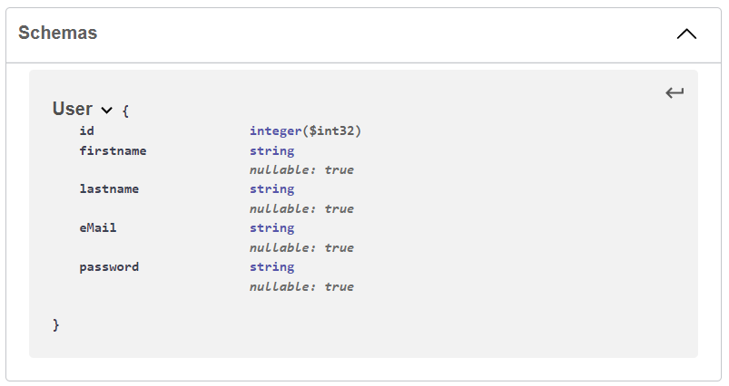

|               |                                           |                                        |
| ------------- | ----------------------------------------- | -------------------------------------- |
| **Modul 295** | **Backend für Applikationen realisieren** |  |

- [1. OpenAPI](#1-openapi)
  - [1.1. Was ist OpenAPI?](#11-was-ist-openapi)
  - [1.2. Warum OpenAPI verwenden?](#12-warum-openapi-verwenden)
- [2. Swagger](#2-swagger)
  - [2.1. Was ist Swagger?](#21-was-ist-swagger)
  - [2.2. Grundlegende Struktur](#22-grundlegende-struktur)
  - [2.3. Swagger Editor](#23-swagger-editor)
  - [2.4. Beispiel ToDo API](#24-beispiel-todo-api)
- [3. Aufgaben](#3-aufgaben)
  - [3.1. Aufgabe OpenAPI (Swagger Editor)](#31-aufgabe-openapi-swagger-editor)

---

</br>

# 1. OpenAPI

## 1.1. Was ist OpenAPI?

Die OpenAPI-Spezifikation (früher Swagger-Spezifikation) ist ein API-Beschreibungsformat für REST-APIs. Eine OpenAPI-Datei ermöglicht es Ihnen, Ihre gesamte API zu beschreiben, einschliesslich:

- Verfügbare Endpunkte (/users) und Operationen für jeden Endpunkt (GET /users, POST /users)
- Operationsparameter Eingabe und Ausgabe für jede Operation
- Authentifizierungsmethoden
- Kontaktinformationen, Lizenz, Nutzungsbedingungen und andere Informationen.

API-Spezifikationen können in YAML oder JSON geschrieben werden. Das Format ist leicht zu erlernen und sowohl für Menschen als auch für Maschinen lesbar.

## 1.2. Warum OpenAPI verwenden?

Die Fähigkeit von APIs, ihre eigene Struktur zu beschreiben, ist die Wurzel aller Erstaunlichkeiten in OpenAPI. Einmal geschrieben, können eine OpenAPI-Spezifikation und Swagger-Tools Ihre API-Entwicklung auf verschiedene Weise vorantreiben:

- Design-First-Benutzer: Verwenden Sie Swagger Codegen, um einen Server-Stub für Ihre API zu generieren. Jetzt muss nur noch die Serverlogik implementiert werden - und schon ist Ihre API einsatzbereit!
- Verwenden Sie Swagger Codegen, um Client-Bibliotheken für Ihre API in über 40 Sprachen zu generieren.
- Verwenden Sie Swagger UI, um eine interaktive API-Dokumentation zu erstellen, mit der Ihre Benutzer die API-Aufrufe direkt im Browser ausprobieren können.
- Verwenden Sie die Spezifikation, um API-bezogene Tools mit Ihrer API zu verbinden.

---

</br>

# 2. Swagger

## 2.1. Was ist Swagger?

Swagger ist eine Reihe von Open-Source-Tools, die um die OpenAPI-Spezifikation herum aufgebaut sind und Ihnen helfen können, REST-APIs zu entwerfen, zu erstellen, zu dokumentieren und zu konsumieren.

Zu den wichtigsten Swagger-Tools gehören:

- **Swagger Editor**: browserbasierter Editor, mit dem Sie OpenAPI-Definitionen schreiben können.
- **Swagger UI**: stellt OpenAPI-Definitionen als interaktive Dokumentation dar.
- **Swagger Codegen**: generiert Server-Stubs und Client-Bibliotheken aus einer OpenAPI-Definition.

## 2.2. Grundlegende Struktur

Sie können OpenAPI-Definitionen in YAML oder JSON schreiben. In diesem Leitfaden verwenden wir nur YAML-Beispiele, aber JSON funktioniert genauso gut. Eine OpenAPI 3.0-Definition in YAML sieht wie folgt aus:

- Metadata
Jede API-Definition muss die Version der OpenAPI-Spezifikation enthalten, auf der diese Definition basiert:

```console
  openapi: 3.0.0
  info:
    title: Sample API
    description: Optional multiline or single-line description in [CommonMark](http://commonmark.org/help/) or HTML.
    version: 0.1.9
```

- Servers
Im Abschnitt Server werden der API-Server und die Basis-URL angegeben. Sie können einen oder mehrere Server definieren, z. B. Produktion und Sandbox.

```console
  servers:
    - url: http://api.example.com/v1
      description: Optional server description, e.g. Main (production) server
    - url: http://staging-api.example.com
      description: Optional server description, e.g. Internal staging server for testing
```

- Paths
Der Abschnitt Pfade definiert einzelne Endpunkte (Pfade) in Ihrer API und die von diesen Endpunkten unterstützten HTTP-Methoden (Operationen)

```console
  paths:
    /users:
      get:
        summary: Returns a list of users.
        description: Optional extended description in CommonMark or HTML.
        responses:
          '200':    # status code
            description: A JSON array of user names
            content:
              application/json:
                schema: 
                  type: array
                  items: 
                    type: string
```

- Parameters
Bei Operationen können Parameter über einen URL-Pfad (/users/{userId}), einen Query-String (/users?role=admin), Header (X-CustomHeader: Value) oder Cookies (Cookie: debug=0) übergeben werden.
Sie können die Datentypen der Parameter, das Format, ob sie erforderlich oder optional sind, und andere Details definieren.

```console
  paths:
    /users/{userId}:
      get:
        summary: Returns a user by ID.
        parameters:
          - name: userId
            in: path
            required: true
            description: Parameter description in CommonMark or HTML.
            schema:
              type : integer
              format: int64
              minimum: 1
        responses: 
          '200':
            description: OK 
```

- Request Body
Wenn ein Vorgang einen Anfragebody sendet, verwenden Sie das Schlüsselwort requestBody, um den Body-Inhalt und den Medientyp zu beschreiben.

```console
  paths:
    /users:
      post:
        summary: Creates a user.
        requestBody:
          required: true
          content:
            application/json:
              schema:
                type: object
                properties:
                  username:
                    type: string
        responses: 
          '201':
            description: Created 
```

- Responses
Für jede Operation können Sie mögliche Statuscodes, wie 200 OK oder 404 Not Found, und das Schema des Antwortkörpers definieren. Schemata können inline definiert oder über $ref referenziert werden. Sie können auch Beispielantworten für verschiedene Inhaltstypen bereitstellen:

```console
  paths:
    /users/{userId}:
      get:
        summary: Returns a user by ID.
        parameters:
          - name: userId
            in: path
            required: true
            description: The ID of the user to return.
            schema:
              type: integer
              format: int64
              minimum: 1
        responses:
          '200':
            description: A user object.
            content:
              application/json:
                schema:
                  type: object
                  properties:
                    id:
                      type: integer
                      format: int64
                      example: 4
                    name:
                      type: string
                      example: Jessica Smith
          '400':
            description: The specified user ID is invalid (not a number).
          '404':
            description: A user with the specified ID was not found.
          default:
            description: Unexpected error 
```

- Input and Output Models
Im Abschnitt "Globale Komponenten/Schemata" können Sie allgemeine Datenstrukturen definieren, die in Ihrer API verwendet werden. Sie können über $ref immer dann referenziert werden, wenn ein Schema erforderlich ist - in Parametern, Request- und Response-Bodies.

```console
  components:
    schemas:
      User:
        type: object
        properties:
          id:
            type: integer
            example: 4
          name:
            type: string
            example: Arthur Dent
        # Both properties are required
        required:  
          - id
          - name 
```
  
Referenzen zu den Komponenten herstellen:

```console
  paths:
    /users/{userId}:
      get:
        summary: Returns a user by ID.
        parameters:
          - in: path
            name: userId
            required: true
            schema:
              type: integer
              format: int64
              minimum: 1
        responses:
          '200':
            description: OK
            content:
              application/json:
                schema:
                  $ref: '#/components/schemas/User'    # <-------
    /users:
      post:
        summary: Creates a new user.
        requestBody:
          required: true
          content:
            application/json:
              schema:
                $ref: '#/components/schemas/User'      # <-------
        responses:
          '201':
            description: Created 

```  

- Authentication
Die Schlüsselwörter securitySchemes und security werden verwendet, um die in Ihrer API verwendeten Authentifizierungsmethoden zu beschreiben.

```console
  components:
    securitySchemes:
      BasicAuth:
        type: http
        scheme: basic
```

</br>

---

## 2.3. Swagger Editor

Entwerfen, beschreiben und dokumentieren Sie Ihre API mit dem ersten Open-Source-Editor, der mehrere API-Spezifikationen und Serialisierungsformate unterstützt.
Der Swagger-Editor bietet eine einfache Möglichkeit, mit der OpenAPI-Spezifikation (früher bekannt als Swagger) sowie der AsyncAPI-Spezifikation zu beginnen, mit Unterstützung für Swagger 2.0, OpenAPI 3.\* und AsyncAPI 2.* Versionen.

## 2.4. Beispiel ToDo API

```json
{
  "openapi": "3.0.1",
  "info": {
    "title": "API V1",
    "version": "v1"
  },
  "paths": {
    "/api/Todo": {
      "get": {
        "tags": [
          "Todo"
        ],
        "operationId": "ApiTodoGet",
        "responses": {
          "200": {
            "description": "Success",
            "content": {
              "text/plain": {
                "schema": {
                  "type": "array",
                  "items": {
                    "$ref": "#/components/schemas/ToDoItem"
                  }
                }
              },
              "application/json": {
                "schema": {
                  "type": "array",
                  "items": {
                    "$ref": "#/components/schemas/ToDoItem"
                  }
                }
              },
              "text/json": {
                "schema": {
                  "type": "array",
                  "items": {
                    "$ref": "#/components/schemas/ToDoItem"
                  }
                }
              }
            }
          }
        }
      },
      "post": {
        …
      }
    },
    "/api/Todo/{id}": {
      "get": {
        …
      },
      "put": {
        …
      },
      "delete": {
        …
      }
    }
  },
  "components": {
    "schemas": {
      "ToDoItem": {
        "type": "object",
        "properties": {
          "id": {
            "type": "integer",
            "format": "int32"
          },
          "name": {
            "type": "string",
            "nullable": true
          },
          "isCompleted": {
            "type": "boolean"
          }
        },
        "additionalProperties": false
      }
    }
  }
}

```

---

</br>

# 3. Aufgaben

## 3.1. Aufgabe OpenAPI (Swagger Editor)

|                     |                                                                                         |
| ------------------- | --------------------------------------------------------------------------------------- |
| **Lernziele**       | Sie können per OpenAPI Spezifikation eine vollständige API                              |
|                     | Beschreibung für CRUD definieren.                                                       |
|                     | Sie können die API-Spezifikation visualisieren und testen.                              |
|                     | Die können aus der OpenAPI Spezifikation die Code Stubs für Server u. Clients erzeugen. |
| **Sozialform**      | Einzelarbeit                                                                            |
| **Auftrag**         | siehe unten                                                                             |
| **Hilfsmittel**     | [Swagger Editor](https://swagger.io/tools/swagger-editor/)                              |
| **Zeitbedarf**      | 60min                                                                                   |
| **Lösungselemente** | API-Dokumentation (JSON)                                                                |

Definiere mit OpenAPI mittels Swagger Editor eine API Beschreibung um Benutzer (users) Einträge vollständig verwalten zu können. Über die API sollen alle CRUD Methoden angeboten werden.
Bestimme dabei auch die Parameter, RequestBodies und Responses.
Definiere zudem auch die Input- und Output-Models und referenziere diese an den sprechenden Requests und Responses ($ref).

- [POST] /users
- [GET] /users
- [PUT] /users/:id
- [DELETE] /users/:id
- [GET] /users/:id


