|               |                                           |                                        |
| ------------- | ----------------------------------------- | -------------------------------------- |
| **Modul 295** | **Backend für Applikationen realisieren** |  |

- [1. REST-based Web Services](#1-rest-based-web-services)
  - [1.1. Nutzen eines REST-Diensts](#11-nutzen-eines-rest-diensts)
  - [1.2. Naming API-Resource](#12-naming-api-resource)
  - [1.3. HTTP Protokoll](#13-http-protokoll)
  - [1.4. HTTP-Verben in REST](#14-http-verben-in-rest)
  - [1.5. URLs und Endpunkte](#15-urls-und-endpunkte)
    - [1.5.1. Beispiele für REST-Endpunkte](#151-beispiele-für-rest-endpunkte)
  - [1.6. HTTP-Statuscodes](#16-http-statuscodes)
    - [1.6.1. HTTP-Statuscode-Bereiche](#161-http-statuscode-bereiche)
    - [1.6.2. Häufige HTTP-Statuscodes](#162-häufige-http-statuscodes)
- [2. JSON Serialization](#2-json-serialization)
  - [2.1. Was ist JSON](#21-was-ist-json)
  - [2.2. Json.NET Library](#22-jsonnet-library)
  - [2.3. Beispiel](#23-beispiel)
- [3. Aufgaben](#3-aufgaben)
  - [3.1. Aufgabe JSON Serialisierung u. Deserialisierung](#31-aufgabe-json-serialisierung-u-deserialisierung)

---

 

# 1. REST-based Web Services

REST (Representational State Transfer)
Es handelt sich um einen Architekturstil für verteilte Systeme und ist oft im Zusammenhang mit Webdiensten zu hören.

**Stateless:** Kein Sitzungsstatus auf dem Server. Jede Anfrage enthält alle benötigten Informationen.
**Client-Server:** Klare Trennung von Benutzeroberfläche (Client) und Datenverarbeitung (Server).
**Cacheable:** Antworten können gecached werden, um Effizienz zu steigern.
**Layered System**: Mögliche Schichten von Servern zwischen Client und End-Server.
**Uniform Interface:** Vereinfachte, einheitliche Schnittstelle zwischen Client und Server.

Nutzen eines REST-Webdiensts mithilfe von REST.
Benutzer erwarten, dass sie jederzeit von jedem Ort aus auf ihre Informationen zugreifen können, indem sie ein beliebiges Gerät verwenden.
Dies führt dazu, dass die meisten App-Entwickler Daten in der Cloud speichern und bei Bedarf von Clientgeräten abrufen.
REST-basierte Web-Services sind die vorherrschende Strategie für diese Art von Device-to-Server-Kommunikation

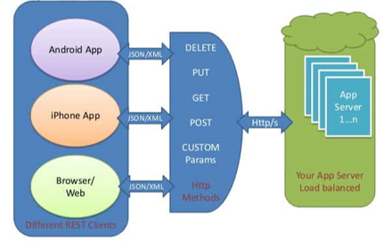

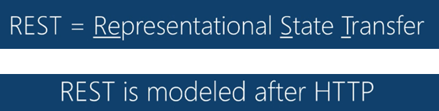

## 1.1. Nutzen eines REST-Diensts

Moderne Anwendungen haben in der Regel eine Internet Verbindung und werden selben isoliert betrieben.
Benutzer erwarten, dass Anwendungen miteinander interagieren oder geräteübergreifende Benutzererfahrungen ermöglichen

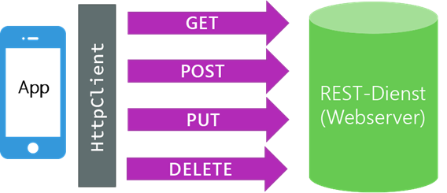

## 1.2. Naming API-Resource

Http-Methoden geben Hinweise darauf, welche Aktion in unserem Rest-API-Aufruf
durchgeführt werden soll

Es ist wichtig, dass die Nomenklatur beschreibend ist.

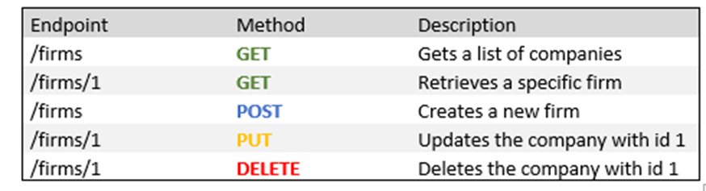

## 1.3. HTTP Protokoll

Das HTTP-Protokoll unterstützt folgende relevante Methoden, wodurch die **CRUD** Operationen abgeleitet werden

| HTTP Methode | CRUD Operation           |
| ------------ | ------------------------ |
| GET          | Datensatz abrufen (read) |
| POST         | Neu Anlegen (create)     |
| PUT          | Aktualisieren (update)   |
| DELETE       | Löschen (delete)         |

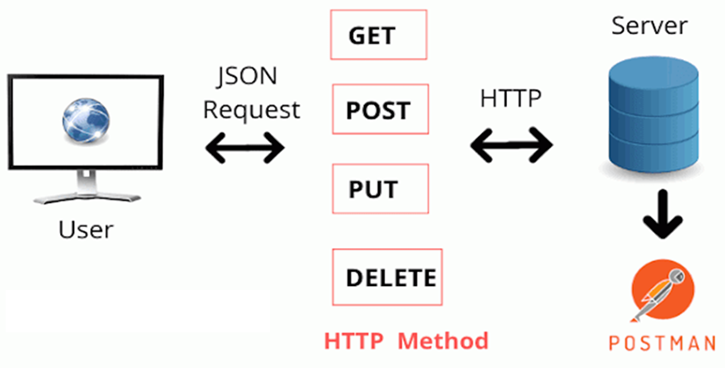

## 1.4. HTTP-Verben in REST

HTTP-Methoden in RESTful APIs fungieren als standardisierte Verben für die Interaktion mit Web-Ressourcen. Sie vereinfachen die Entwicklung, da sie intuitive Operationen wie Abrufen, Hinzufügen und Löschen ermöglichen. Die Server-Implementierung bestimmt die spezifische Behandlung jeder Methode.

- GET: **Daten abrufen**
- POST: **Daten hinzufügen**
- PUT/PATCH: **Daten aktualisieren**
- DELETE: **Daten löschen**

## 1.5. URLs und Endpunkte

URLs (**Uniform Resource Locators**) dienen im Internet als Adressen für Ressourcen. Sie sind der Schlüssel für den Zugriff auf Daten über das Web.

In RESTful APIs werden URLs verwendet, um spezifische Ressourcen zu identifizieren. Diese Ressourcen können dann durch verschiedene HTTP-Methoden manipuliert werden. Ein Endpunkt ist eine spezielle URL, die einen bestimmten Aspekt einer Ressource oder eine Gruppe von Ressourcen repräsentiert.

### 1.5.1. Beispiele für REST-Endpunkte

- **GET** `/books`: Liste aller Bücher abrufen
- **POST** `/books`: Neues Buch hinzufügen
- **GET** `/books/1`: Einzelnes Buch mit ID 1 abrufen
- **PUT** `/books/1`: Buch mit ID 1 aktualisieren
- **DELETE** `/books/1`: Buch mit ID 1 löschen

## 1.6. HTTP-Statuscodes

HTTP-Statuscodes sind dreistellige Codes, die vom Server zurückgegeben werden, um den Status einer HTTP-Anfrage anzuzeigen. Sie informieren den Client darüber, ob die Anfrage erfolgreich war, ob weitere Aktionen erforderlich sind oder ob ein Fehler aufgetreten ist. Sie sind in verschiedene Bereiche unterteilt, um die Art der Antwort zu kennzeichnen.

### 1.6.1. HTTP-Statuscode-Bereiche

| Bereich | Beschreibung                                                                                  |
| ------- | --------------------------------------------------------------------------------------------- |
| 1xx     | Informational - Anfrage wurde empfangen und verarbeitet                                       |
| 2xx     | Erfolgreich - Anfrage wurde erfolgreich empfangen, verstanden und akzeptiert                  |
| 3xx     | Umleitung - Weiterleitung erforderlich, um die Anfrage abzuschließen                          |
| 4xx     | Client-Fehler - Anfrage enthält einen ungültigen Parameter oder kann nicht verarbeitet werden |
| 5xx     | Server-Fehler - Server konnte die Anfrage nicht verarbeiten                                   |

### 1.6.2. Häufige HTTP-Statuscodes

| Nummer | Beschreibung          |
| ------ | --------------------- |
| 200    | OK                    |
| 201    | Created               |
| 204    | No Content            |
| 400    | Bad Request           |
| 401    | Unauthorized          |
| 403    | Forbidden             |
| 404    | Not Found             |
| 500    | Internal Server Error |
| 502    | Bad Gateway           |
| 503    | Service Unavailable   |

Für eine vollständige Liste der HTTP-Statuscodes, siehe [Wikipedia: HTTP-Statuscode](https://de.wikipedia.org/wiki/HTTP-Statuscode).

---

 

# 2. JSON Serialization

Wie können mit Json.NET Objekte serialisieren / deserialisieren werden.

> **.NET objects must be serilized into bytes to transmitted over a network.**

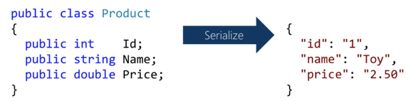
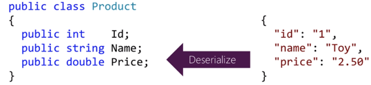

## 2.1. Was ist JSON

JavaScript Object Notation (JSON) uses name/value text pairs for serilization.

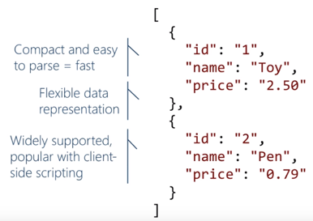

## 2.2. Json.NET Library

Json.NET provides a full-feature JSON library

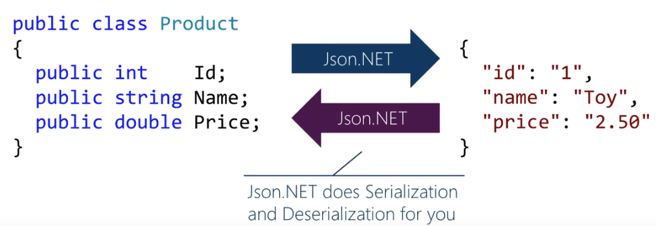

## 2.3. Beispiel

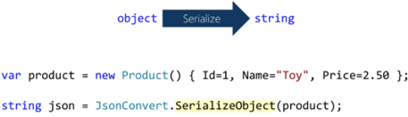

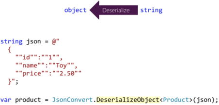

---

 

# 3. Aufgaben

## 3.1. Aufgabe JSON Serialisierung u. Deserialisierung

|                     |                                                                                                              |
| ------------------- | ------------------------------------------------------------------------------------------------------------ |
| **Lernziele**       | Sie können Objekte nach JSON serialisieren                                                                   |
|                     | Sie können JSON-Daten in ein Objekt deserialisieren                                                          |
|                     | Sie können die API-Spezifikation visualisieren und testen.                                                   |
| **Sozialform**      | Einzelarbeit                                                                                                 |
| **Auftrag**         | siehe unten                                                                                                  |
| **Hilfsmittel**     | [Microsoft Learn](https://learn.microsoft.com/en-us/dotnet/standard/serialization/system-text-json/overview) |
| **Zeitbedarf**      | 60min                                                                                                        |
| **Lösungselemente** | C# Consolenprojekt                                                                                           |

- Erstelle in Visual Studio das Konolenprojekt (SerializeBasic) und implementiere das Serisalization Beispiel (WeatherForecast).
  - <https://learn.microsoft.com/en-us/dotnet/standard/serialization/system-text-json/how-to>

- Erstelle in Visual Studio das Konolenprojekt (DeserializeExtra) und implementiere das Serisalization Beispiel (WeatherForecast).
  - <https://learn.microsoft.com/en-us/dotnet/standard/serialization/system-text-json/deserialization>
