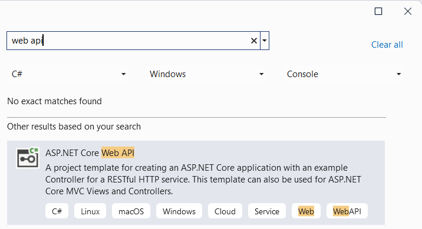
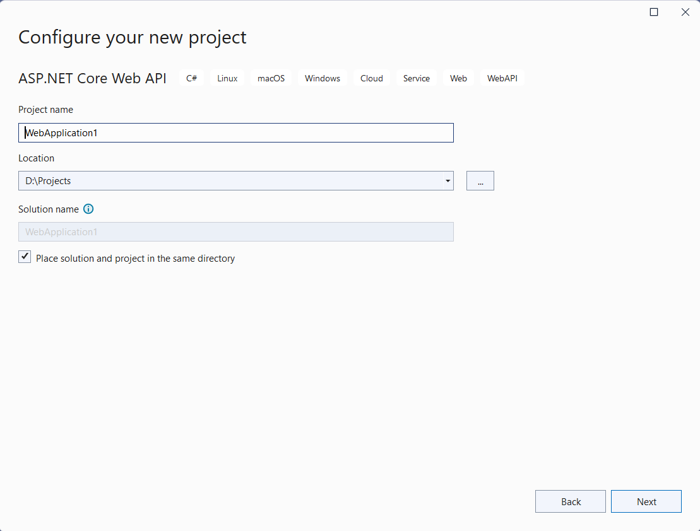
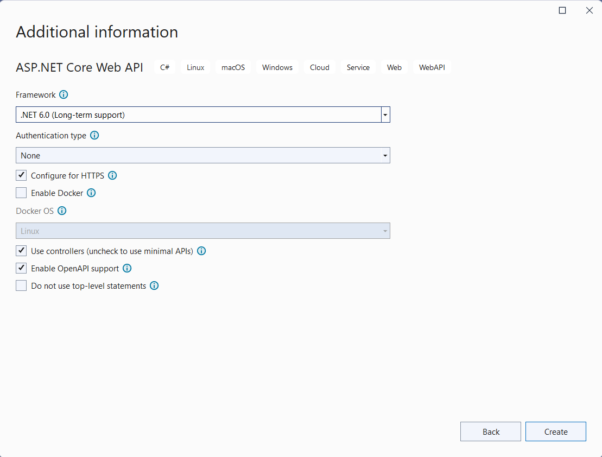
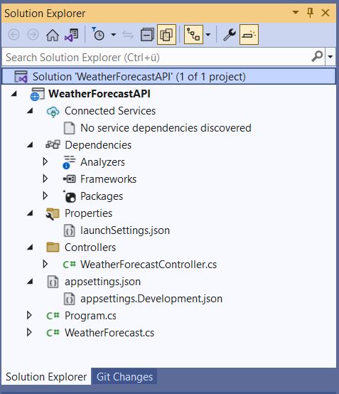
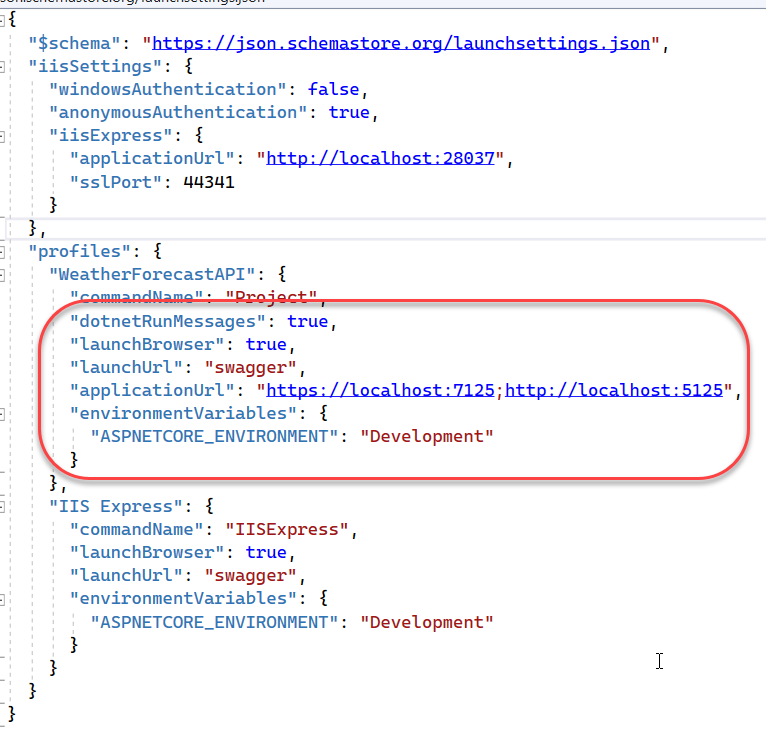
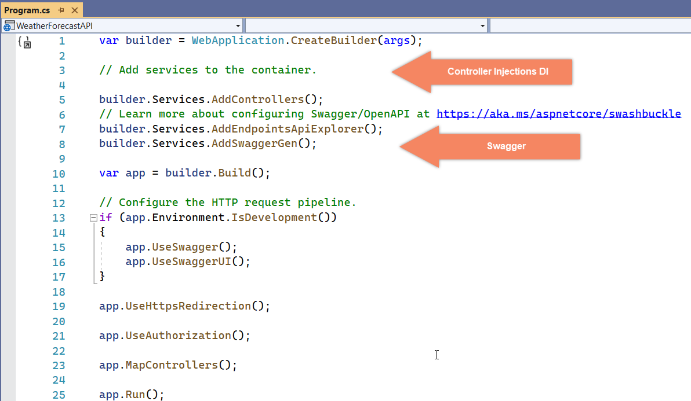
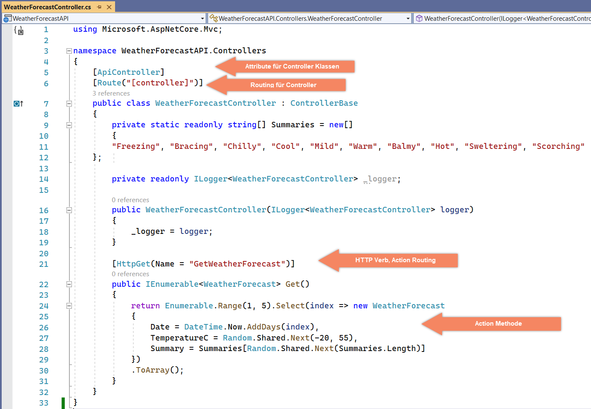
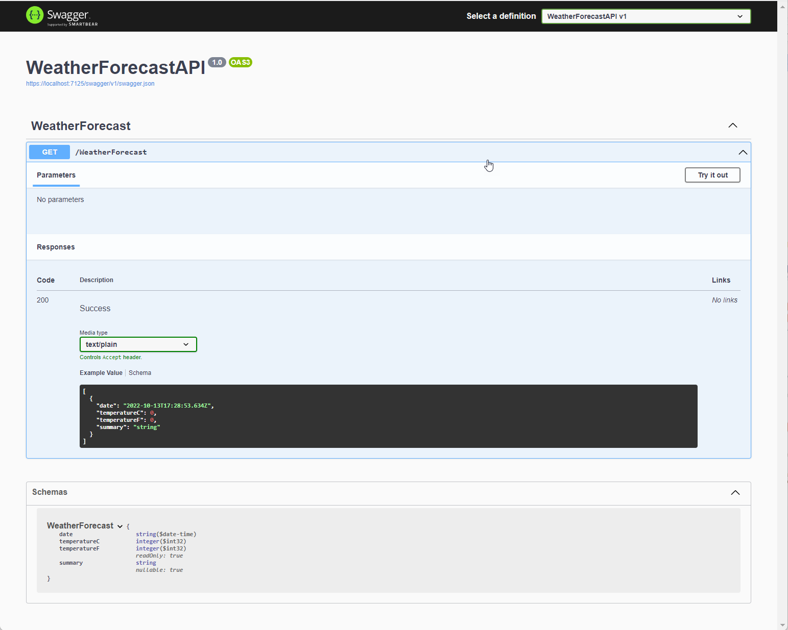

|               |                                           |                                        |
| ------------- | ----------------------------------------- | -------------------------------------- |
| **Modul 295** | **Backend für Applikationen realisieren** |  |

- [1. ASP.NET Core WebAPI](#1-aspnet-core-webapi)
  - [1.1. Was ist ASP.NET WebAPI](#11-was-ist-aspnet-webapi)
  - [1.2. Hauptmerkmale von ASP.NET Core WebAPI](#12-hauptmerkmale-von-aspnet-core-webapi)
  - [1.3. Beispiel einer einfachen ASP.NET Core WebAPI](#13-beispiel-einer-einfachen-aspnet-core-webapi)
- [2. Aufgaben](#2-aufgaben)
  - [2.1. WebAPI Template Projekt](#21-webapi-template-projekt)
    - [2.1.1. Erstelle gemäss nachfolgender Beschreibung ein erstes ASP.NET Core WebAPI Projekt](#211-erstelle-gemäss-nachfolgender-beschreibung-ein-erstes-aspnet-core-webapi-projekt)
    - [2.1.2. Visual Studio Projektstruktur](#212-visual-studio-projektstruktur)
    - [2.1.3. launchSettings.json](#213-launchsettingsjson)
    - [2.1.4. Einstiegspunkt (Program.cs)](#214-einstiegspunkt-programcs)
    - [2.1.5. Controller Klasse](#215-controller-klasse)
    - [2.1.6. API-Testen mit Swagger u. Postman](#216-api-testen-mit-swagger-u-postman)
  - [2.2. Visual Studio Code WebAPI Template Projekt](#22-visual-studio-code-webapi-template-projekt)
  - [2.3. WebAPI Tutorial ToDo (Create a web API with controllers)](#23-webapi-tutorial-todo-create-a-web-api-with-controllers)

---

</br>

# 1. ASP.NET Core WebAPI

## 1.1. Was ist ASP.NET WebAPI

ASP.NET Core WebAPI ist ein Framework von Microsoft, das es Entwicklern ermöglicht, Web-APIs zu erstellen und bereitzustellen.
Es ist ein Teil des ASP.NET Core-Frameworks, das eine plattformübergreifende, modulare und leistungsstarke Grundlage für die Entwicklung von Webanwendungen, APIs und Microservices bietet.
ASP.NET Core ist die modernisierte und verbesserte Version von ASP.NET, die speziell für die Cloud und moderne Webanwendungen entwickelt wurde.

WebAPI ist eine Abkürzung für Web Application Programming Interface und bezeichnet eine Schnittstelle, die es ermöglicht, Daten über HTTP (in der Regel in Form von JSON oder XML) zu übertragen.
Dies ermöglicht die Interaktion zwischen verschiedenen Softwarekomponenten, z. B. zwischen einer mobilen Anwendung und einem Server, oder zwischen verschiedenen Microservices.

## 1.2. Hauptmerkmale von ASP.NET Core WebAPI

**Plattformunabhängigkeit:** ASP.NET Core ist auf mehreren Plattformen (Windows, macOS, Linux) verfügbar.

**Leistung:** Es wurde von Grund auf optimiert, um hohe Leistung zu erzielen, und nutzt die neuesten Technologien für schnelles Rendering und effizienten Betrieb.

**RESTful APIs:** Mit ASP.NET Core WebAPI können Sie RESTful APIs erstellen, die auf HTTP-Methoden wie GET, POST, PUT, DELETE usw. basieren, um CRUD-Operationen (Create, Read, Update, Delete) auf Ressourcen zu ermöglichen.

**Modularität:** ASP.NET Core folgt einem modularen Ansatz, bei dem nur die benötigten Komponenten in einer Anwendung eingebunden werden, was zu einer kleineren und schnelleren Anwendung führt.

**Integration mit anderen Technologien:** ASP.NET Core WebAPI kann mit verschiedenen Datenbanken und Technologien (wie Entity Framework Core, SQL Server, MongoDB, Redis usw.) zusammenarbeiten.

**Sicherheitsfeatures:** Es bietet eingebaute Sicherheitsfunktionen, darunter Authentifizierung und Autorisierung (z. B. mit JWT, OAuth, oder Identity Server).

ASP.NET Core WebAPI ist eine leistungsstarke und flexible Möglichkeit, moderne Web-APIs zu entwickeln.
Es bietet zahlreiche Funktionen und Vorteile, die Entwicklern helfen, skalierbare, wartbare und sichere APIs zu erstellen, die auf **verschiedenen Plattformen** laufen.

## 1.3. Beispiel einer einfachen ASP.NET Core WebAPI

```c#
using Microsoft.AspNetCore.Mvc;

namespace MyApi.Controllers
{
    [Route("api/[controller]")]
    [ApiController]
    public class WeatherForecastController : ControllerBase
    {
        private static readonly string[] Summaries = new[]
        {
            "Freezing", "Bracing", "Chilly", "Cool", "Mild", "Warm", "Balmy", "Hot", "Sweltering", "Scorching"
        };

        private readonly ILogger<WeatherForecastController> _logger;

        public WeatherForecastController(ILogger<WeatherForecastController> logger)
        {
            _logger = logger;
        }

        [HttpGet]
        public IEnumerable<WeatherForecast> Get()
        {
            var rng = new Random();
            return Enumerable.Range(1, 5).Select(index => new WeatherForecast
            {
                Date = DateTime.Now.AddDays(index),
                TemperatureC = rng.Next(-20, 55),
                Summary = Summaries[rng.Next(Summaries.Length)]
            })
            .ToArray();
        }
    }
}
```

---

</br>

# 2. Aufgaben

## 2.1. WebAPI Template Projekt

|                     |                                                                                               |
| ------------------- | --------------------------------------------------------------------------------------------- |
| **Lernziele**       | Sie können in Visual Studio ein ASP.NET Core WebAPI Projekt anlegen                           |
|                     | Sie können die Projektverzeichnisstruktur erläutern                                           |
|                     | Sie können eine Projekt starten und testen                                                    |
| **Sozialform**      | Einzelarbeit                                                                                  |
| **Auftrag**         | siehe unten                                                                                   |
| **Hilfsmittel**     | [Microsoft Learn](https://learn.microsoft.com/en-us/aspnet/core/web-api/?view=aspnetcore-9.0) |
| **Zeitbedarf**      | 60min                                                                                         |
| **Lösungselemente** | Lauffähiges ASP.NET Core WebAPI Projekt                                                       |

### 2.1.1. Erstelle gemäss nachfolgender Beschreibung ein erstes ASP.NET Core WebAPI Projekt

Projekt erstellen







### 2.1.2. Visual Studio Projektstruktur

- **Program.cs**
  - Startpunkt der Anwendung
- **appsettings.json**
  - Konfigurationsdatei z.B. für Datenbankverbindung etc.
- **Controller**
  - Hier befinden sich alle Controller Klassen



### 2.1.3. launchSettings.json

Start profiles (z.B. IIS, usw.)



### 2.1.4. Einstiegspunkt (Program.cs)

Hier werden alle Services registriert (siehe Dependency Injection) und die Controller gemappt.
Zudem wird auch die Swagger (Open-API) eingebunden.



### 2.1.5. Controller Klasse

Hier werden alle Action-Methoden des Controllers implementiert.



### 2.1.6. API-Testen mit Swagger u. Postman



---

</br>

## 2.2. Visual Studio Code WebAPI Template Projekt

|                     |                                                                                                        |
| ------------------- | ------------------------------------------------------------------------------------------------------ |
| **Lernziele**       | Sie können in Visual Studio Code ein ASP.NET Core WebAPI Projekt anlegen                               |
|                     | Sie können die Projektverzeichnisstruktur erläutern                                                    |
|                     | Sie können eine Projekt starten und testen                                                             |
| **Sozialform**      | Einzelarbeit                                                                                           |
| **Auftrag**         | siehe unten                                                                                            |
| **Hilfsmittel**     | [Microsoft Learn](https://learn.microsoft.com/de-de/dotnet/core/tools/dotnet-new-sdk-templates#webapi) |
| **Zeitbedarf**      | 30min                                                                                                  |
| **Lösungselemente** | Lauffähiges ASP.NET Core WebAPI Projekt                                                                |

Anstelle Visual Studio kann für die Entwicklung auch Visual Studio Code verwendet werden.

Verwenden Sie hierfür den folgenden Kommandozeilenbefehl:

- `dotnet new webapi --use-controllers --output WeatherForecastAPI --framework net8.0`

Es kann ein Entwicklerzertifikat installiert werden:

- `dotnet dev-certs https --trust`

Das Projekt aus dem Terminal wie folgt gestaret werden:

- `dotnet run --launch-profile https`

Die Swagger Dokumentation kann wie folgt im Browser abgerufen werden:

- `https://localhost:5001/swagger`

Optionale Pakete z.B. Entity Framework können wie folgt einem Projekt hinzugefügt werden:

- `dotnet add package Microsoft.EntityFrameworkCore.SqlServer`
- `dotnet add package Microsoft.EntityFrameworkCore.Tools`

---

</br>

## 2.3. WebAPI Tutorial ToDo (Create a web API with controllers)

|                     |                                                                                               |
| ------------------- | --------------------------------------------------------------------------------------------- |
| **Lernziele**       | Sie können in Visual Studio ein ASP.NET Core WebAPI Projekt anlegen                           |
|                     | Sie können die Projektverzeichnisstruktur erläutern                                           |
|                     | Sie können eine Projekt starten und testen                                                    |
| **Sozialform**      | Einzelarbeit                                                                                  |
| **Auftrag**         | siehe unten                                                                                   |
| **Hilfsmittel**     | [Microsoft Learn](https://learn.microsoft.com/en-us/aspnet/core/web-api/?view=aspnetcore-9.0) |
| **Zeitbedarf**      | 60min                                                                                         |
| **Lösungselemente** | Lauffähiges ASP.NET Core WebAPI Projekt                                                       |

Implementiere das "**Create a web API with ASP.NET Core**" Projekt komplett indem die sämtliche Schritte ausgeführt werden.

- [Tutorial](https://learn.microsoft.com/en-us/aspnet/core/tutorials/first-web-api?view=aspnetcore-9.0&tabs=visual-studio)
- Teste das API mit Postman oder VSC-REST-Extension
