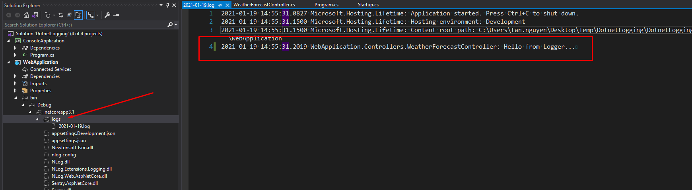
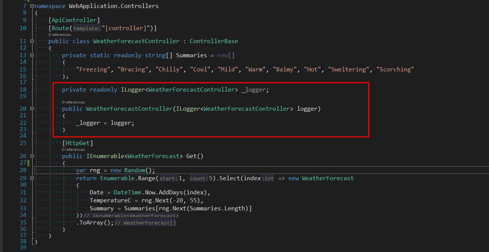
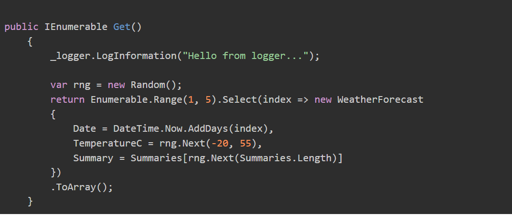
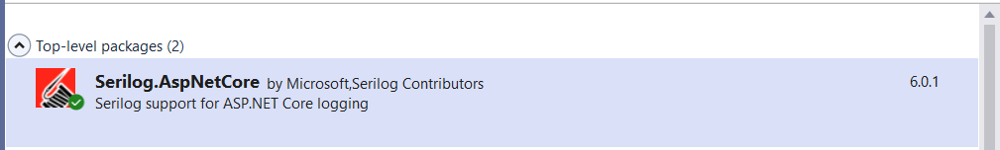

|               |                                           |                                        |
| ------------- | ----------------------------------------- | -------------------------------------- |
| **Modul 295** | **Backend für Applikationen realisieren** |  |

- [1. Protokollierung / Logging](#1-protokollierung--logging)
  - [1.1. Warum Logging](#11-warum-logging)
  - [1.2. Logging Providers](#12-logging-providers)
  - [1.3. Beispiel einer Protokolldatei](#13-beispiel-einer-protokolldatei)
  - [1.4. Controller-Klassen](#14-controller-klassen)
- [2. Serilog](#2-serilog)
  - [2.1. Was ist Serilog?](#21-was-ist-serilog)
  - [2.2. Konfiguration](#22-konfiguration)
  - [2.3. Logger Registrierung](#23-logger-registrierung)
  - [2.4. Beispiel von Protokollmeldungen](#24-beispiel-von-protokollmeldungen)
- [3. Aufgaben](#3-aufgaben)
  - [3.1. ASP.NET Core Logging mit serilog](#31-aspnet-core-logging-mit-serilog)

---

</br>

# 1. Protokollierung / Logging

## 1.1. Warum Logging

Die Protokollierung ist ein wichtiger Bestandteil jeder Anwendung um ein System überwachen zu können. Solange alles reibungslos läuft, brauchen Sie es nicht, aber wenn Sie ein Problem mit Ihrer Anwendung haben, kann ein Protokoll zur Fehlerlokalisierung sehr hilfreich sein.
Diese Protokolle bieten eine wertvolle Grundlage für die Fehlerbehebung, Performance-Überwachung, Sicherheit und Dokumentation.

Hauptgründe, warum das Protokollieren wichtig ist:

- **Fehlerbehebung und Debugging:** Wenn bei der Nutzung eines Webservices ein Problem auftritt, können Protokolle helfen, die Ursache zu identifizieren.
- **Überwachung der Performance:** Protokolle können Daten zur Antwortzeit des Webservices enthalten, wie lange eine Anfrage dauert, oder wie häufig bestimmte Anfragen gestellt werden
- **Sicherheitsüberwachung:** Protokolle bieten wichtige Informationen zur Sicherheit des Webservices. Sie können unautorisierte Zugriffsversuche, verdächtige Aktivitäten oder Angriffsversuche
- **Verwaltung von Geschäftsprozessen und Auditing:** In vielen Anwendungsfällen müssen Geschäftsprozesse nachvollziehbar und transparent sein
- **Analyse und Reporting:** Durch das Sammeln und Auswerten von Protokolldaten können Entwickler und Betreiber von Webservices Muster im Nutzerverhalten erkennen, sowie bevorzugte oder häufig genutzte Funktionen und Endpunkte identifizieren
- **Skalierbarkeit und Lastverteilung:** Protokolle ermöglichen es, die Nutzung des Webservices zu überwachen und Lastspitzen zu erkennen

Zusammengefasst sorgt das Protokollieren von Webservices dafür, dass Betreiber und Entwickler wichtige **Informationen zur Verwaltung, Sicherheit, Fehlerbehebung und Performance-Überwachung** erhalten. Es stellt sicher, dass der Webservice stabil und zuverlässig funktioniert und ermöglicht es, Probleme schnell zu identifizieren und zu beheben.

## 1.2. Logging Providers

Der .NET build-in Logger bietet Möglichkeiten Nachrichten auf der Konsole, in Debug, EvenLog, Datenbank, etc. zu protokollieren, jedoch keine die Nachrichten in eine Protokolldatei schreibt.
Nebst dem .NET build-in Logger (Microsoft.Extensions.Logging), existieren daher eine Vielzahl von verschiedenen Third-party Logging Providers:

- Nlog
- Serilog
- Log4Net
- …

## 1.3. Beispiel einer Protokolldatei



## 1.4. Controller-Klassen

Die Controller-Klassen erhalten den zu verwendenden Logger als generischer Typ (Interface) gewöhnlich über den Konstruktor aus dem **Dependency-Injection-System** in welchem der Logger registriert ist.



Logmeldungen können somit in der Controller-Methoden einfach ausgegeben werden.



---

</br>

# 2. Serilog

## 2.1. Was ist Serilog?

- Serilog ist eine .NET-Bibliothek, die eine Diagnoseprotokollierung in Dateien, auf der Konsole und fast überall, wo Sie es wünschen, ermöglicht.
- Serilog kann in klassischen .NET-Framework-Anwendungen und für Anwendungen verwendet werden, die unter dem neuesten und besten .NET x laufen.
- Eine der größten Stärken von Serilog ist, dass es mit Blick auf eine strukturierte Protokollierung entwickelt wurde.
- <https://serilog.net/>



## 2.2. Konfiguration

`appsettings.json`

```json
{
    "Logging": {
        "LogLevel": {
            "Default": "Information",
            "Microsoft.AspNetCore": "Warning"
        }
    },
    "AllowedHosts": "*",
    "Serilog": {
        "Using": [ "Serilog.Sinks.File" ],
        "MinimumLevel": {
            "Default": "Information"
        },
        "WriteTo": [
            {
                "Name": "File",
                "Args": {
                    "path": "logs/webapi-.log",
                    "rollingInterval": "Day",
                    "outputTemplate": "[{Timestamp:yyyy-MM-dd HH:mm:ss.fff zzz} {CorrelationId} {Level:u3}] {Username} {Message:lj}{NewLine}{Exception}"
                }
            }
        ]
    }
}
```

---

## 2.3. Logger Registrierung

Logger Registrierung in `Program.cs`

```c#
// Nuget
// Serilog.AspNetCore

var builder = WebApplication.CreateBuilder(args);

// Add services to the container.

// Seri Logger ohne appsettings.json Konfiguration
var loggerFromCode = new LoggerConfiguration()
  .MinimumLevel.Information()
  .WriteTo.File(path: "logs/webapi-.log", 
    rollingInterval: RollingInterval.Day, 
    outputTemplate: "[{Timestamp:yyyy-MM-dd HH:mm:ss.fff zzz} {CorrelationId} {Level:u3}] {Username} {Message:lj}{NewLine}{Exception}")
    .CreateLogger();

// Seri Logger mit appsettings.json Konfiguration
var loggerFromSettings = new LoggerConfiguration()
  .ReadFrom.Configuration(builder.Configuration)
  .Enrich.FromLogContext()
  .CreateLogger();

builder.Logging.ClearProviders();
builder.Logging.AddSerilog(loggerFromSettings);

builder.Services.AddControllers();
```

## 2.4. Beispiel von Protokollmeldungen

```console
[2022-01-22 17:15:54.496 +01:00  INF]  Now listening on: https://localhost:7068
[2022-01-22 17:15:54.520 +01:00  INF]  Now listening on: http://localhost:5068
[2022-01-22 17:15:54.524 +01:00  INF]  Application started. Press Ctrl+C to shut down.
[2022-01-22 17:15:54.524 +01:00  INF]  Hosting environment: Development
[...]
[2022-01-22 17:16:06.353 +01:00  INF]  Request starting HTTP/2 GET https://localhost:7068/WeatherForecast - -
[2022-01-22 17:16:06.359 +01:00  INF]  Executing endpoint 'SerilogDemo.Controllers.WeatherForecastController.Get (SerilogDemo)'
[2022-01-22 17:16:06.367 +01:00  INF]  Route matched with {action = "Get", controller = "WeatherForecast"}. Executing controller action with signature System.Collections.Generic.IEnumerable`1[SerilogDemo.WeatherForecast] Get() on controller SerilogDemo.Controllers.WeatherForecastController (SerilogDemo).
[2022-01-22 17:16:06.369 +01:00  INF]  Weather Forecast executing...
[2022-01-22 17:16:06.371 +01:00  INF]  Executing ObjectResult, writing value of type 'SerilogDemo.WeatherForecast[]'.
[2022-01-22 17:16:06.380 +01:00  INF]  Executed action SerilogDemo.Controllers.WeatherForecastController.Get (SerilogDemo) in 9.1166ms
[2022-01-22 17:16:06.381 +01:00  INF]  Executed endpoint 'SerilogDemo.Controllers.WeatherForecastController.Get (SerilogDemo)'
[2022-01-22 17:16:06.382 +01:00  INF]  Request finished HTTP/2 GET https://localhost:7068/WeatherForecast - - - 200 - application/json;+charset=utf-8 28.4984ms
```

---

</br>

# 3. Aufgaben

## 3.1. ASP.NET Core Logging mit serilog

|                     |                                                                                                                           |
| ------------------- | ------------------------------------------------------------------------------------------------------------------------- |
| **Lernziele**       | Sie können ein Web API Projekt mit einer Protokollierung erweitern, die mehrere Protokollierungsstufe anbietet.           |
|                     | Sie sind in der Lage die Art und Umfang der Protokollierung über eine Konfiguration zu steuern.                           |
|                     | Sie können zwecks Ablaufverfolgung an verschiedenen Stellen in der Anwendung geeignete Protokollmeldungen ausgeben.       |
|                     | Sie können anhand den Protokollmeldungen den Ablauf einer Programmausführung nachvollziehen und ggf. Fehler lokalisieren. |
| **Sozialform**      | Einzelarbeit                                                                                                              |
| **Auftrag**         | siehe unten                                                                                                               |
| **Hilfsmittel**     | [Microsoft Learn](https://learn.microsoft.com/en-us/aspnet/core/web-api/?view=aspnetcore-9.0)                             |
| **Zeitbedarf**      | 60min                                                                                                                     |
| **Lösungselemente** | Web API Projekt mit Logdatei Protokollierung, Logdatei der Anwendung.                                                     |

**Aufgabe 1 - File Protokollierung**
Erstelle über die Standardvorlage (Template) in Visual Studio ein neues ASP.NET Core Web API Projekt und implementiere in diesem Projekt eine Protokollierung (Logger), die verschiedene Nachrichten (Info, Warnings, Error, etc.) in eine Protokolldatei schreibt.

- Verwende hierfür die Third-party Komponente SeriLog (<https://serilog.net/>) über den NuGet Package Manager.
- Registriere die Logger-Komponenten in der Program.cs Datei.
- Ergänze den WeatherForecast Controller, sodass jeder Actionaufruf (Get) in der Protokolldatei festgehalten wird.
- Prüfe die Meldungen in der Logdatei.

**Aufgabe 2 - Protokollkonfiguration**
Erweitere die Anwendung, sodass die Protokolleinstellungen wie Log-Dateiname, Log-Level usw. über die appsettings.json Datei konfigurierbar sind.
