|               |                                           |                                        |
| ------------- | ----------------------------------------- | -------------------------------------- |
| **Modul 295** | **Backend für Applikationen realisieren** |  |

- [1. ASP.NET Core WebAPI](#1-aspnet-core-webapi)
  - [1.1. Start Template](#11-start-template)
  - [1.2. Erläuterung zu Program.cs](#12-erläuterung-zu-programcs)
  - [1.3. Controllers](#13-controllers)
  - [1.4. Routing](#14-routing)
  - [1.5. Attribute Routing](#15-attribute-routing)
  - [1.6. DTO-Klassen](#16-dto-klassen)
  - [1.7. POST-Request](#17-post-request)
  - [1.8. DELETE-Request](#18-delete-request)
  - [1.9. PUT-Request](#19-put-request)
  - [1.10. Validation](#110-validation)
- [2. Restful API Naming Conventions Guidlines](#2-restful-api-naming-conventions-guidlines)
  - [2.1. Richtlinien für API-Namenskonventionen](#21-richtlinien-für-api-namenskonventionen)
  - [2.2. Was sind Ressourcen?](#22-was-sind-ressourcen)
  - [2.3. Allgemeine Konventionen](#23-allgemeine-konventionen)
  - [2.4. Zusammenfassung](#24-zusammenfassung)
    - [2.4.1. Best Practices](#241-best-practices)
- [3. Aufgaben](#3-aufgaben)
  - [3.1. Tutorial Pizza REST-API](#31-tutorial-pizza-rest-api)
  - [3.2. User REST-API](#32-user-rest-api)
  - [3.3. Movie REST-API mit SQL-Datenbank](#33-movie-rest-api-mit-sql-datenbank)
  - [3.4. Movie REST-API mit Service u. DTO-Klassen](#34-movie-rest-api-mit-service-u-dto-klassen)
  - [3.5. REST API Ski-Service Migration (ASP.NET Core), Optional](#35-rest-api-ski-service-migration-aspnet-core-optional)

---

</br>

# 1. ASP.NET Core WebAPI

## 1.1. Start Template

In einem typischen ASP.NET Core Web API-Projekt wird die Program.cs-Datei verwendet, um die Anwendung zu konfigurieren und zu starten.
Die Struktur von `Program.cs` wurde stark vereinfacht und die vorherige `Startup.cs`-Datei durch direkte Konfiguration in Program.cs ersetzt.

Die `Program.cs` in einem ASP.NET Core Web API-Projekt ist der **Einstiegspunkt** der Anwendung, wo der Webserver aufgebaut, konfiguriert und gestartet wird.
In dieser Datei werden alle notwendigen Dienste (z. B. Controller, Swagger, etc.) registriert, Middleware für HTTP-Anfragen konfiguriert und schliesslich die Anwendung gestartet, sodass sie auf Anfragen reagieren kann.

`Program.cs`

```c#
var builder = WebApplication.CreateBuilder(args);

// Füge Dienste zum Container hinzu.
builder.Services.AddControllers(); // Fügt die Controller-Dienste hinzu.

builder.Services.AddEndpointsApiExplorer(); // Ermöglicht die Dokumentation von Endpunkten (z. B. mit Swagger).
builder.Services.AddSwaggerGen(); // Fügt Swagger-Dokumentation hinzu.

var app = builder.Build(); // Baut die Webanwendung.

if (app.Environment.IsDevelopment()) // Überprüft, ob die Anwendung sich in der Entwicklungsumgebung befindet.
{
    app.UseSwagger(); // Aktiviert Swagger, wenn die Anwendung in der Entwicklung ist.
    app.UseSwaggerUI(); // Startet die Swagger-UI zur API-Dokumentation.
}

app.UseHttpsRedirection(); // Leitet alle HTTP-Anfragen zu HTTPS um.

app.UseAuthorization(); // Aktiviert die Autorisierung (für geschützte Endpunkte).

app.MapControllers(); // Mappt die Routen für die Controller, die in der Anwendung definiert sind.

app.Run(); // Startet die Webanwendung.
```

## 1.2. Erläuterung zu Program.cs

`var builder = WebApplication.CreateBuilder(args);`

- Diese Zeile erstellt ein WebApplicationBuilder-Objekt, das zur Konfiguration der Webanwendung verwendet wird.

`builder.Services.AddControllers();`

- Fügt die erforderlichen Dienste für die Web-API-Controller hinzu.
- Diese Zeile sorgt dafür, dass die Controller und deren Middleware korrekt registriert werden, damit sie auf HTTP-Anfragen reagieren können.

`builder.Services.AddEndpointsApiExplorer();`

- Dies fügt einen Dienst hinzu, der es ermöglicht, die Endpunkte der API zu entdecken und für Dokumentationszwecke zu verwenden.

`builder.Services.AddSwaggerGen();`

- Aktiviert die Erstellung von Swagger-Dokumentation für die API.

`var app = builder.Build();`

- Nachdem alle benötigten Dienste konfiguriert sind, wird die Webanwendung mit der Build()-Methode tatsächlich erstellt.
- An diesem Punkt ist die Anwendung bereit, HTTP-Anfragen zu empfangen.

`if (app.Environment.IsDevelopment())`

- Diese Bedingung überprüft, ob die Anwendung in der Entwicklungsumgebung läuft.
- Die Umgebung wird automatisch basierend auf der Konfiguration (z. B. über Umgebungsvariablen) gesetzt.

`app.UseSwagger();`

- Diese Zeile aktiviert Swagger, sodass die API-Dokumentation im JSON-Format generiert werden kann.

`app.UseSwaggerUI();`

- Diese Zeile startet die Swagger-UI, eine benutzerfreundliche Oberfläche, die es ermöglicht, die API zu durchsuchen und interaktiv zu testen.
- Diese UI wird nur in der Entwicklungsumgebung aktiviert.

`app.UseHttpsRedirection();`

- Diese Middleware sorgt dafür, dass alle HTTP-Anfragen automatisch zu HTTPS umgeleitet werden.

`app.UseAuthorization();`

- Diese Zeile fügt die Autorisierungs-Middleware hinzu, die sicherstellt, dass API-Endpunkte, die durch Sicherheitsmechanismen (z. B. Authentifizierung und Autorisierung) geschützt sind, korrekt behandelt werden.

`app.MapControllers();`

- Diese Methode verbindet die Controller mit den eingehenden HTTP-Anfragen. Sie sorgt dafür, dass alle Routen, die in den Controller-Aktionen definiert sind (z. B. [HttpGet]-Attribute), korrekt verarbeitet werden.

`app.Run();`

- Diese Methode startet die Webanwendung. Sie blockiert den weiteren Code und beginnt mit dem Hören auf eingehende HTTP-Anfragen.
- Diese Zeile muss zuletzt aufgerufen werden, um den **Webserver zu starten**.

## 1.3. Controllers

Controller sind für die Bearbeitung von Anfragen, die Modellvalidierung und die Rückgabe von Antworten an das Frontend oder einen HTTP-Client zuständig.
Wenn Sie den Controller im Hauptprojekt erstellen möchten, klicken Sie mit der rechten Maustaste auf den Ordner Controllers und dann auf **Add=>Controller**.

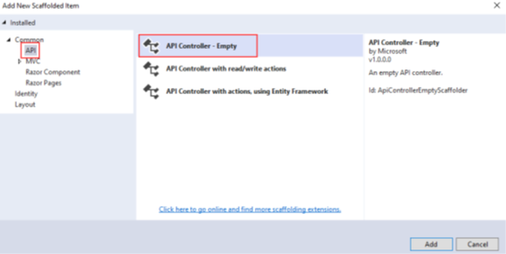

- Die **Geschäftslogik** ist in **Controllern** Klassen zuprogrammieren, um sie schlank zu halten und den Code lesbarer und wartbarer zu machen.
- Jede Web-API-Controllerklasse erbt von der abstrakten Klasse `ControllerBase`, die alle erforderlichen Verhaltensweisen für die abgeleitete Klasse bereitstellt.
- Die Kontroller-Klassen müssen mit dem Attribut `[Route("api/[controller]")]` versehen sein.
Dieses Attribut ist für das Routing wichtig. Das Web-API-Routing leitet eingehende HTTP-Anfragen an eine bestimmte Aktionsmethode innerhalb des Web-API-Controllers weiter

## 1.4. Routing

- Konventionsbasiertes Routing wird so genannt, weil es eine Konvention für die URL-Pfade festlegt.
- Der erste Teil erstellt die Zuordnung für den Controller-Namen
- Der zweite Teil erstellt die Zuordnung für die Aktionsmethode
- Der dritte Teil wird für den optionalen Parameter verwendet.

Das Routing kann wie folgt konfiguriert werden (Program.cs):

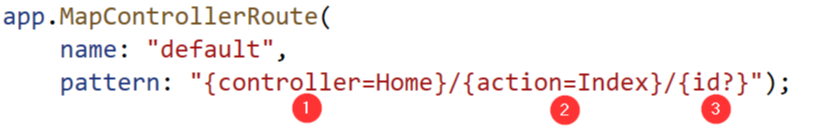

## 1.5. Attribute Routing

- Beim Attribut-Routing werden die Attribute verwendet, um die Routen direkt den **Aktionsmethoden** innerhalb des Controllers zuzuordnen.
- Normalerweise platzieren wir die **Basisroute** oberhalb der Controller-Klasse, wie Sie in unserer Web-API-Controller-Klasse sehen können.
- In ähnlicher Weise erstellen wir für die spezifischen **Aktionsmethoden** ihre Routen direkt über ihnen.

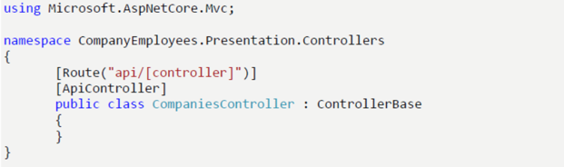

- Für eine Anfrage zum Abrufen, `post` oder `delete` verwenden wir dieselbe URI `/api/companies`, aber wir verwenden unterschiedliche HTTP-Methoden wie **GET**, **POST** oder **DELETE**.
- Das im URI verwendete **Substantiv** stellt die Ressource dar und hilft dem Anwender zu verstehen, mit welcher Art von Ressource wir arbeiten.

Es kann auch eine Hierarchie zwischen Ressourcen aufgebaut werden.
Wenn wir eine Route für eine abhängige Entität erstellen, sollten wir eine etwas andere Konvention befolgen: `/api/principalResource/{principalId}/dependentResource`.

z.B.
Da Mitarbeiter nicht ohne ein Unternehmen existieren können, sollte die Route für die Ressource des Mitarbeiters `/api/companies/{companyId}/employees` lauten.

Indem wir die Aktion GetCompanies mit dem Attribut `[HttpGet]` ausstatten, ordnen wir diese Aktion der GET-Anforderung zu.

```c#
[Route("api/companies")] 
[ApiController] 
public class CompaniesController : ControllerBase 
{ 
  private readonly IServiceManager _service; 
  public CompaniesController(IServiceManager service) => _service = service; 

  [HttpGet] 
  public IActionResult GetCompanies() 
  { 
    try 
    { 
      var companies = _service.CompanyService.GetAllCompanies(trackChanges: false); 

      return Ok(companies); 
    } 
    catch 
    { 
      return StatusCode(500, "Internal server error"); 
    } 
  } 
} 
```

## 1.6. DTO-Klassen

- Ein Datenübertragungsobjekt (DTO) ist ein Objekt, das für den **Datentransport zwischen Client- und Serveranwendungen** verwendet wird.
- Es ist keine gute Praxis, Entitäten in der Web-API-Antwort zurückzugeben stattdessen sollten Datenübertragungsobjekte verwenden werden (siehe auch AutoMapper).

```c#
public IEnumerable<CompanyDto> GetAllCompanies(bool trackChanges) 
{ 
 try 
 { 
  var companies = _repository.Company.GetAllCompanies(trackChanges); 
  var companiesDto = companies.Select(c => 
        new CompanyDto(c.Id, c.Name ?? "", string.Join(' ', c.Address, c.Country))) 
        .ToList(); 
  return companiesDto; 
} 
catch (Exception ex) 
} 
```

## 1.7. POST-Request

- Der POST Methode wird eine **DTO Klasse** übergeben, die in eine Domain Model Klasse konvertiert werden muss.
- Es wir die selbe URI wie bei GET verwenden `(api/companies)`.
Methode ist mit `[HttpPost]` Attribute versehen.

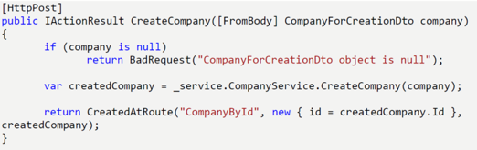
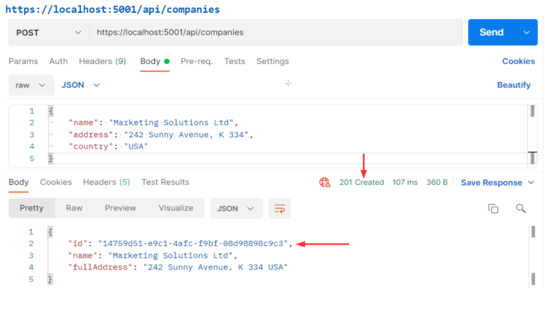

Die Daten werden **nicht aus dem URI**, sondern aus dem Body der Anfrage gesammelt.
Daher ist die Verwendung des Attributs `[FromBody]` (komplexer Datentyp)

## 1.8. DELETE-Request

Die `companyId` wird aus der Root-Route und die `ID des Mitarbeiters` aus dem übergebenen Argument übernommen.
Über die Methode `NoContent()` wird Statuscode 204 No Content zurückgeliefert.

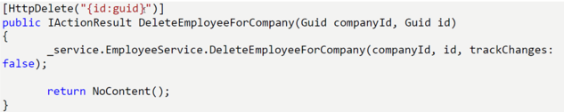
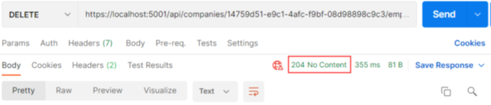

## 1.9. PUT-Request

Wir verwenden das **PUT-Attribut** mit dem `id`-Parameter, um diese Aktion zu annotieren.
Das bedeutet, dass unsere Route für diese Aktion wie folgt lautet: `api/companies/{companyId}/employees/{id}`.
Falls das Objekt employee null ist, wir eine `BadRequest`-Antwort zurückgeliefert.

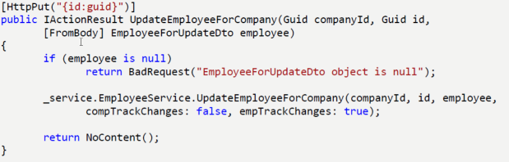


## 1.10. Validation

Beim Schreiben von API-Aktionen gibt es eine Reihe von Regeln, die zu überprüfen sind.
Durch verschiedene **Datenattribute** können Eigenschaften wie max. Länge usw festgelegt werden:

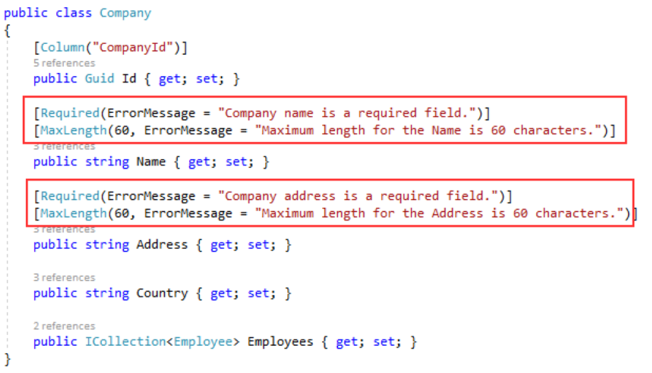

Mit **Validierungsattributen** können wir Validierungsregeln für Modelleigenschaften festlegen.
Diese Attribute (`Required` und `MaxLength`) sind Teil der eingebauten Attribute.

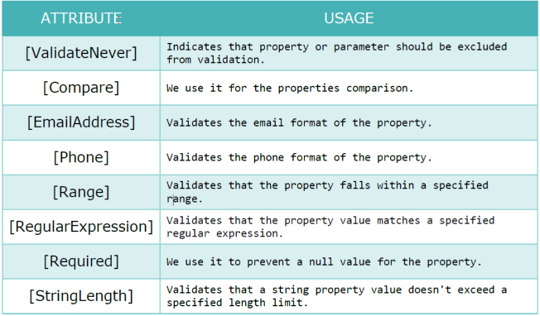

---

</br>

# 2. Restful API Naming Conventions Guidlines

## 2.1. Richtlinien für API-Namenskonventionen

- Verwenden Sie **Substantive** zur Darstellung von Ressourcen / keine Verben
- Generell gilt: Substantive sind gut und Verben sind schlecht.

So nicht, schlechte Beispiele:

```console
http://api.example.com/v1/user/CreateUser
http://api.example.com/v1/user/GetUser({UserId})
http://api.example.com/v1/user/updateUser({UserId})
http://api.example.com/v1/user/deleteUser({UserId})
```

Korrekte Beispiele:

```console
http://api.example.com/v1/users
http://api.example.com/v1/users/id
```

## 2.2. Was sind Ressourcen?

Eine Sammlung von Substantiven, wie z. B. Menschen in einer Organisation, Rechnungen, die in einem System existieren, analog einer Entität.

Immer pluralisierte Substantive für Ressourcen verwenden

Schlechte Beispiele:

```console
http://api.example.com/v1/user/1
http://api.example.com/v1/department
```

Korrekte Beispiele:

```console
http://api.example.com/v1/users/1
http://api.example.com/v1/departments
```

## 2.3. Allgemeine Konventionen

Verwenden Sie **Bindestriche** (-), um die Lesbarkeit von URIs zu verbessern.
Verwenden Sie **keine** Grossbuchstaben oder **Unterstriche**, um Wörter in URLs zu trennen.
Bei langen Wörtern ist die Verwendung von (-) zu verwenden.

Schlechte Beispiele:

```console
http://api.example.com/v1/usermanagement
http://api.example.com/v1/userManagement
```

Korrektes Beispiele:

```console
http://api.example.com/v1/users-management
```

**Schrägstriche** (/) für Hierarchien verwenden
Schrägstriche werden verwendet, um die Hierarchie zwischen einzelnen Ressourcen und Sammlungen darzustellen.

Korrektes Beispiele:

```console
http://api.example.com/v1/users/{Id}/departments
```

Verwendung von **Query-Strings** für Nicht-Ressourcen-Eigenschaften
So könnten Sie Query-String zum Sortieren, zur Seite, zur Angabe eines Formats usw. verwenden.

Beispiele:

```console
http://api.example.com/v1/users?page=10
```

Verwenden Sie keine Dateierweiterungen in URLs.

```console
http://api.example.com/v1/users.json
http://api.example.com/v1/users.xml
```

Filter, Sortierung, Reihenfolge ...etc. **nicht** als Ressource behandeln
Dies bedeutet, dass der Filter, die Sortierung, die Reihenfolge usw. nicht als Parameter, sondern in einem Abfrage-String gesendet werden sollte.

Schlechtes Beispiel:

```console
http://api.example.com/v1/users/orderBy/name
```

Konrektes Beispiel:

```console
http://api.example.com/v1/users?orderBy=name
```

## 2.4. Zusammenfassung

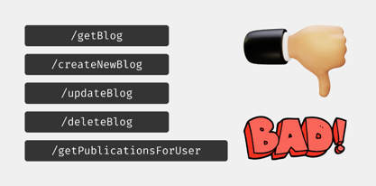

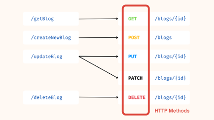

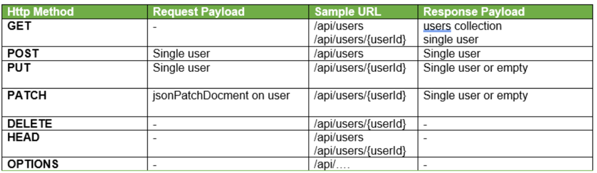

### 2.4.1. Best Practices

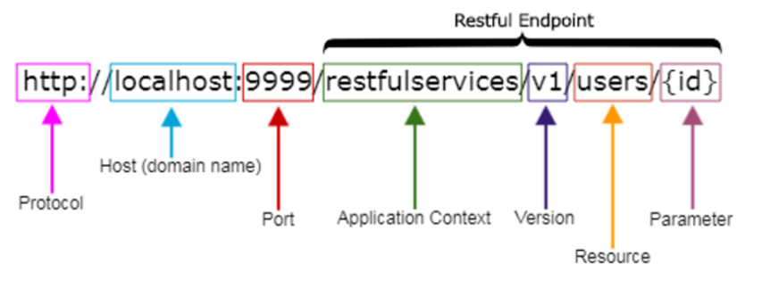

# 3. Aufgaben

## 3.1. Tutorial Pizza REST-API

|                     |                                                                                               |
| ------------------- | --------------------------------------------------------------------------------------------- |
| **Lernziele**       | Sie können ein Web API Projekt erstellen.                                                     |
|                     | Sie sind in der Lage Controller Klassen anzulegen                                             |
|                     | Sie können CRUD-Aktionsmethoden implementieren                                                |
|                     | Sie können die korrekte Funktionsweise prüfen (Postman, REST).                                |
| **Sozialform**      | Einzelarbeit                                                                                  |
| **Auftrag**         | siehe unten                                                                                   |
| **Hilfsmittel**     | [Microsoft Learn](https://learn.microsoft.com/en-us/aspnet/core/web-api/?view=aspnetcore-9.0) |
| **Zeitbedarf**      | 40min                                                                                         |
| **Lösungselemente** | Lauffähiges komplettes Web API Projekt, Präsentation der Lösung                               |

Arbeiten Sie dieses Tutorial Schritt für Schritt komplett durch.
<https://learn.microsoft.com/en-us/training/modules/build-web-api-aspnet-core/>

---

## 3.2. User REST-API

|                     |                                                                                               |
| ------------------- | --------------------------------------------------------------------------------------------- |
| **Lernziele**       | Sie können ein Web API Projekt erstellen.                                                     |
|                     | Sie sind in der Lage Controller Klassen anzulegen                                             |
|                     | Sie können die korrekten Routings und Path's einstellen.                                      |
|                     | Sie können die korrekte Funktionsweise prüfen (Postman, REST).                                |
| **Sozialform**      | Einzelarbeit                                                                                  |
| **Auftrag**         | siehe unten                                                                                   |
| **Hilfsmittel**     | [Microsoft Learn](https://learn.microsoft.com/en-us/aspnet/core/web-api/?view=aspnetcore-9.0) |
| **Zeitbedarf**      | 90min                                                                                         |
| **Lösungselemente** | Lauffähiges komplettes Web API Projekt, Präsentation der Lösung                               |

- Implementiere gemäss nachfolgendem Klassendiagramm und Open-API Dokumentation das Web-API Projekt in Visual Studio mit ASP.NET Core (**Name = UserApi**).
- Testen Sie die Funktionsweise mit Postman oder REST (VC-Extension)

**Bemerkung:** Die Userdaten werden in der UserService Klasse verwaltet und müssen nicht gespeichert werden.

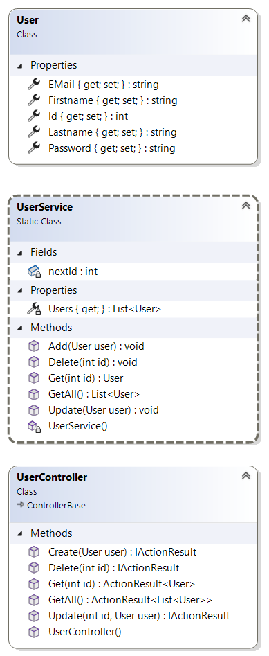

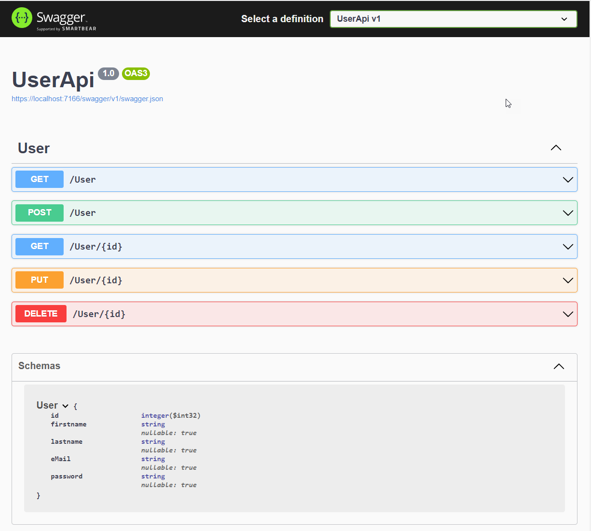

---

## 3.3. Movie REST-API mit SQL-Datenbank

|                     |                                                                                               |
| ------------------- | --------------------------------------------------------------------------------------------- |
| **Lernziele**       | Sie können ein Web API Projekt erstellen.                                                     |
|                     | Sie sind in der Lage Controller Klassen anzulegen                                             |
|                     | Sie können die korrekten Routings und Path's einstellen.                                      |
|                     | Sie können die Code-First mit Entity Framework umsetzen                                       |
|                     | Sie können mittels den CRUD Operationen Mutationen in einer SQL- Datenbank vornehmen.         |
|                     | Sie können die korrekte Funktionsweise prüfen (Postman, REST).                                |
| **Sozialform**      | Einzelarbeit                                                                                  |
| **Auftrag**         | siehe unten                                                                                   |
| **Hilfsmittel**     | [Microsoft Learn](https://learn.microsoft.com/en-us/aspnet/core/web-api/?view=aspnetcore-9.0) |
| **Zeitbedarf**      | 120min                                                                                        |
| **Lösungselemente** | Lauffähiges komplettes Web API Projekt, Präsentation der Lösung                               |

Implementiere gemäss nachfolgendem Klassendiagramm und Open-API Dokumentation das Web-API Projekt in Visual Studio mit ASP.NET Core Web API (**Name=MoviesAPIv1**).

- Verwende für den Datenbankzugriff das Entity-Framework mit der Code-First Variante.
- Dabei müssen die in der nachfolgenden API-Spezifikation enthaltenen Methoden vollständig implementiert werden.
- Die Userdaten sollen mittels den CRUD Operationen in einer Datenbank gespeichert werden.
- Testen Sie alle API Methoden mit Postman

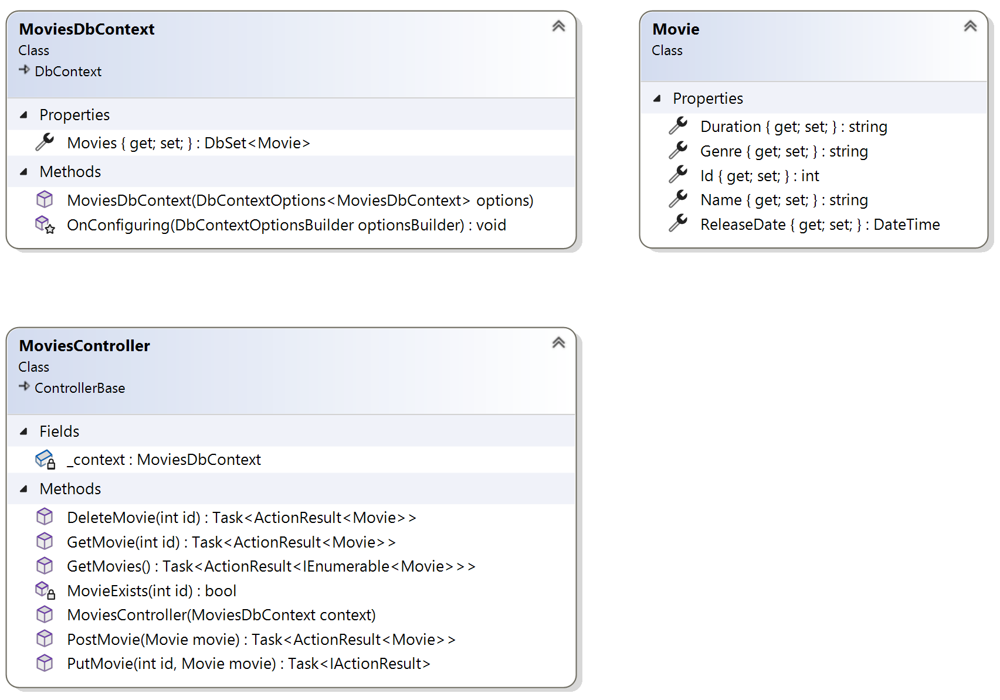

Erstelle für die Controller- u. Model-Klassen einen separaten Projektordner

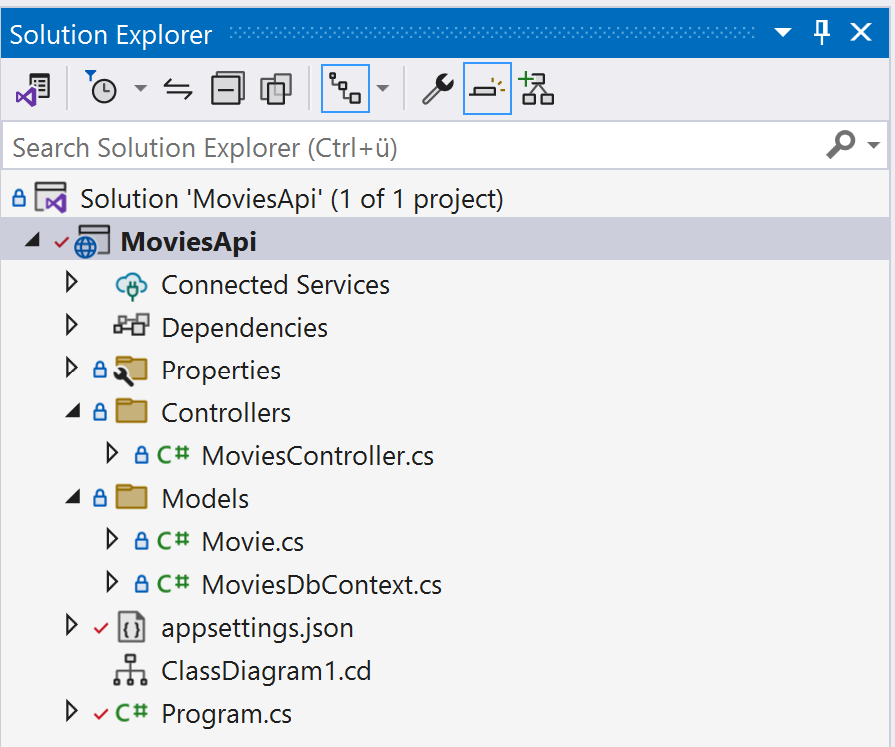

Folgende NuGet-Pakete müssen dem Projekt hinzugefügt werden.

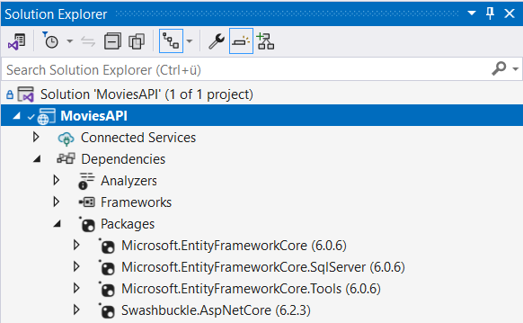

Für den Konstruktor der Controller-Klasse (`MoviesController`) muss der `DbContext` (Datenbankverbindung) registriert sein.

```c#
// create web app builder
var builder = WebApplication.CreateBuilder(args);

// add all controller
builder.Services.AddControllers();

// add DbContext class
builder.Services.AddDbContext<MoviesDbContext>(options => 
    options.UseSqlServer(builder.Configuration.GetConnectionString("MoviesDbConnectionString")));

// add Swagger
builder.Services.AddSwaggerGen();

app.UseHttpsRedirection();
app.UseRouting();
app.UseAuthorization();
app.UseEndpoints(endpoints =>
{
    endpoints.MapControllers();
});

app.Run();
```

OpenAPI-Spezifikation (Swagger)

[OpenAPI](./x_gitres/MovieAPI-OpenAPI.json)
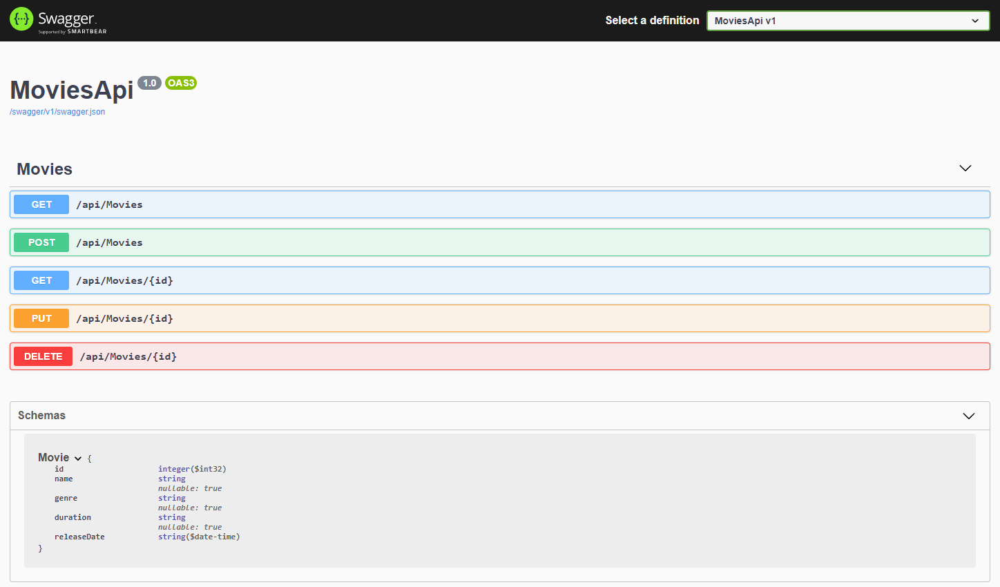

---

## 3.4. Movie REST-API mit Service u. DTO-Klassen

|                     |                                                                                               |
| ------------------- | --------------------------------------------------------------------------------------------- |
| **Lernziele**       | Sie können ein Web API Projekt erstellen.                                                     |
|                     | Sie sind in der Lage Controller Klassen anzulegen                                             |
|                     | Sie können die korrekten Routings und Path's einstellen.                                      |
|                     | Sie können die Code-First mit Entity Framework umsetzen                                       |
|                     | Sie können mittels den CRUD Operationen Mutationen in einer SQL- Datenbank vornehmen.         |
|                     | Sie können den Einsatz von Service Klassen konkret umsetzen                                   |
|                     | Sie können DTO Klassen korrekt für den Datenaustausch einsetzen                               |
|                     | Sie können die korrekte Funktionsweise prüfen (Postman, REST).                                |
| **Sozialform**      | Einzelarbeit                                                                                  |
| **Auftrag**         | siehe unten                                                                                   |
| **Hilfsmittel**     | [Microsoft Learn](https://learn.microsoft.com/en-us/aspnet/core/web-api/?view=aspnetcore-9.0) |
| **Zeitbedarf**      | 120min                                                                                        |
| **Lösungselemente** | Lauffähiges komplettes Web API Projekt, Präsentation der Lösung                               |

Implementiere gemäss nachfolgendem Klassendiagramm und Open-API Dokumentation das Web-API Projekt in Visual Studio mit ASP.NET Core Web API (**Name=MoviesAPIv2**).

- Verwende für den Datenbankzugriff das Entity-Framework mit der **Code-First** Variante.
- Dabei müssen die in der nachfolgenden API-Spezifikation enthaltenen Methoden vollständig implementiert werden.
- Die Userdaten sollen mittels den CRUD Operationen in einer Datenbank gespeichert werden.
- Testen Sie alle API Methoden mit Postman

Erstelle für folgende Elemente eigene Projektordner:

- Models
- Services
- DTO
- Controllers

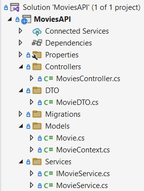

Folgende NuGet-Pakete müssen dem Projekt hinzugefügt werden.


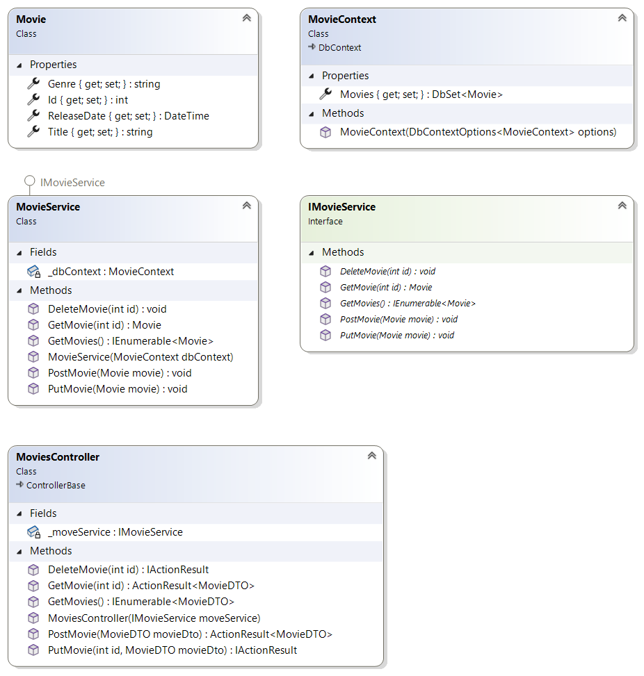

Service-Registrierung (DI)
An die `MoviesController` Klasse wird die Service-Klasse (`IMovieService`) per DI übergeben.
Das dies funktioniert muss im Main() die Serviceklasse registriert (`AddScoped()`) sein.

```c#
var builder = WebApplication.CreateBuilder(args);
builder.Services.AddScoped<IMovieService, MovieService>();

// Add services to the container.
builder.Services.AddDbContext<MovieContext>(options =>
    options.UseSqlServer(builder.Configuration.GetConnectionString("MovieDB")));

// ...
```

OpenAPI-Spezifikation (Swagger)

[OpenAPI](./x_gitres/MovieAPI-OpenAPI.json)
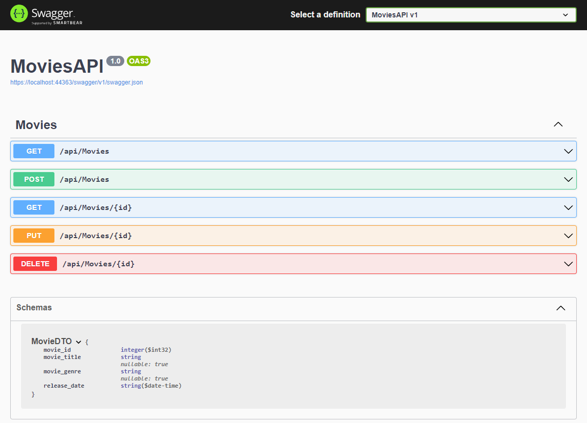

---

## 3.5. REST API Ski-Service Migration (ASP.NET Core), Optional

|                     |                                                                                               |
| ------------------- | --------------------------------------------------------------------------------------------- |
| **Lernziele**       | Sie können ein Web API Projekt erstellen.                                                     |
|                     | Sie sind in der Lage Controller Klassen anzulegen                                             |
|                     | Sie können die korrekten Routings und Path's einstellen.                                      |
|                     | Sie können mittels den CRUD Operationen Mutationen in einer SQL- Datenbank vornehmen.         |
|                     | Sie können die korrekte Funktionsweise prüfen (Postman, REST).                                |
| **Sozialform**      | Einzelarbeit                                                                                  |
| **Auftrag**         | siehe unten                                                                                   |
| **Hilfsmittel**     | [Microsoft Learn](https://learn.microsoft.com/en-us/aspnet/core/web-api/?view=aspnetcore-9.0) |
| **Zeitbedarf**      | 120min                                                                                        |
| **Lösungselemente** | Lauffähiges komplettes Web API Projekt, Präsentation der Lösung                               |

Erstellen Sie für Ihr Frontend der Ski-Service Anmeldung aus dem Modul 294 ein ASP.NET Web-API Backend.

- Dabei müssen die in der nachfolgenden API-Spezifikation enthaltenen Methoden vollständig implementiert werden.
- Die Anmeldungsdaten sollen nun in einer SQL-Datenbank gespeichert werden.

OpenAPI-Spezifikation

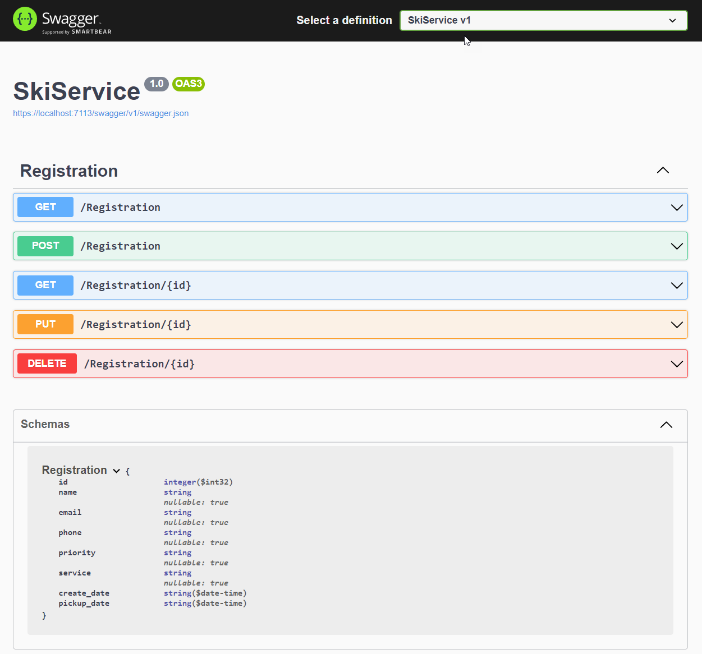
