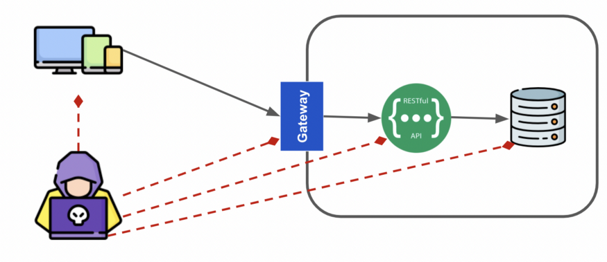
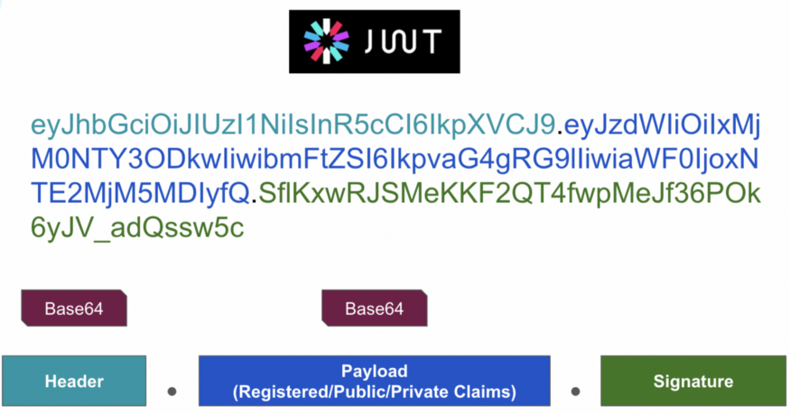
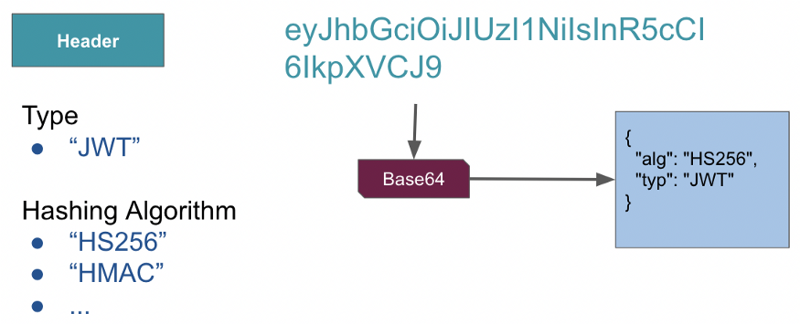
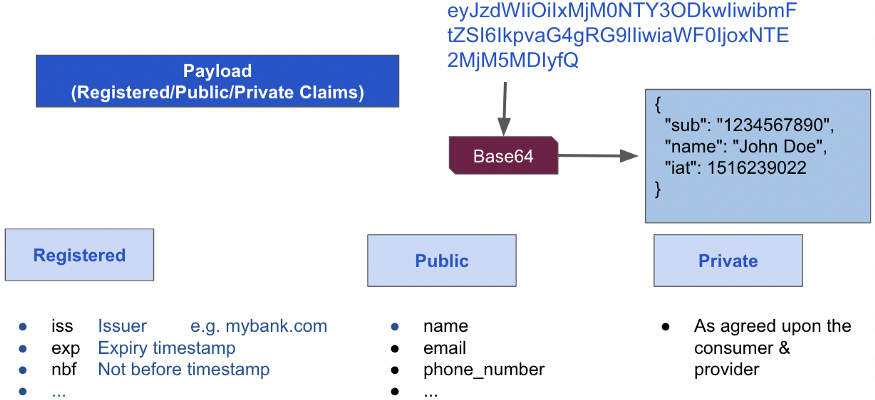
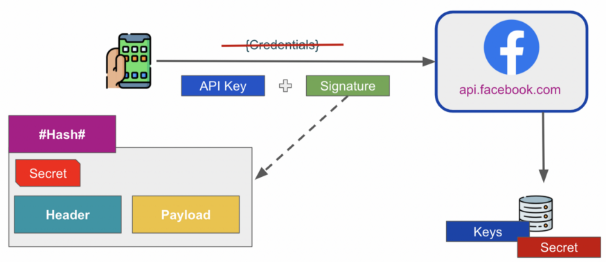

|               |                                           |                                        |
| ------------- | ----------------------------------------- | -------------------------------------- |
| **Modul 295** | **Backend für Applikationen realisieren** |  |

- [1. REST API Authentication](#1-rest-api-authentication)
  - [1.1. Authentifizierung](#11-authentifizierung)
  - [1.2. Hacker Angriff](#12-hacker-angriff)
  - [1.3. Datensicherheit](#13-datensicherheit)
  - [1.4. API Authentication](#14-api-authentication)
    - [1.4.1. Basisauthentifizierung](#141-basisauthentifizierung)
    - [1.4.2. Token Based Authentication](#142-token-based-authentication)
    - [1.4.3. API-Key \& Secret based Authentication](#143-api-key--secret-based-authentication)
    - [1.4.4. OAuth 2.0](#144-oauth-20)
    - [1.4.5. Session-basierte Authentifizierung](#145-session-basierte-authentifizierung)
  - [1.5. Fazit](#15-fazit)
- [2. Random String Generator](#2-random-string-generator)
- [3. Aufgaben](#3-aufgaben)
  - [3.1. WebAPI Authentifikation](#31-webapi-authentifikation)
  - [3.2. API-Key Authentifikation Implementierung](#32-api-key-authentifikation-implementierung)
  - [3.3. JWT Authentifikation (TODO:)](#33-jwt-authentifikation-todo)

---

# 1. REST API Authentication

## 1.1. Authentifizierung

Die **Authentifizierung** in einer REST Web API-Anwendung ist entscheidend, um sicherzustellen, dass **nur autorisierte Benutzer** oder Clients auf die API zugreifen können. In einer RESTful Web API gibt es verschiedene gängige Methoden zur Authentifizierung, die jeweils unterschiedliche Anwendungsfälle und Sicherheitsanforderungen abdecken

## 1.2. Hacker Angriff

APIs sind heute das Frontend aller modernen Softwareanwendungen. Von der Essensbestellung bis zum Teilen von Fotos auf Instagram, vom Online-Einkauf bis zur Geldüberweisung - sie sind überall im Einsatz.

Eines der Hauptanliegen eines jeden API-Anbieters ist die Sicherung der übertragenen Daten. Die Idee ist, dass die Daten geheim sein sollten, dass sie unverändert bleiben sollten, während sie in Bewegung sind.



Das Bild zeigt ein typischer Anwendungsablauf in einem Unternehmen. Die Anwendung stellt über mehrere Angriffspunkte wie Gateway und API-Server eine Verbindung zu den Daten her. Ein Angriff kann an fast jedem dieser Punkte erfolgen.

- Der Angreifer kann die Anwendung angreifen und die Daten manipulieren oder die Identität stehlen.
- Der Angreifer kann sich die Schwachstellen des Gateways ansehen und dann tatsächlich eine Verbindung zu den Backend-Systemen herstellen.
- Der Angreifer kann auch die Firewall überwinden und direkt auf den API-Server oder die Datenbanken zugreifen.
- Als API-Entwickler müssen Sie all diese Angriffsmöglichkeiten bei der Entwicklung Ihrer APIs berücksichtigen. Die beste Lösung zum Schutz Ihrer API wäre, den Angreifer daran zu hindern, Ihren API-Verwaltungsserver oder die API selbst zu erreichen.

## 1.3. Datensicherheit

Die Datensicherheit umfasst die Verwaltung von Maßnahmen zum Schutz der Daten vor unbefugtem Zugriff oder Diebstahl sowie die Wahrung der Integrität der Daten.

Die Daten in den Datenbankservern und anderen Infrastrukturen liegen außerhalb des Bereichs von REST-API-Entwurf und -Implementierung und können von Ihnen als API-Designer nicht kontrolliert werden.

Sie müssen mit anderen Beteiligten zusammenarbeiten, um sicherzustellen, dass die Daten in REST geschützt sind. Die in Bewegung befindlichen Daten, d. h. die Daten, die von einem Mobiltelefon oder einer anderen Anwendung an Ihre API übertragen werden, fallen hingegen in den Bereich des Entwurfs und der Implementierung einer REST-API.

Es gibt drei Hauptaspekte, die Sie heute aus Sicht der API-Sicherheit berücksichtigen müssen:

- **Authentifizierung**
- **Autorisierung**
- **funktionale Angriffe**

## 1.4. API Authentication

Es gibt drei Möglichkeiten, die API-Authentifizierung zu implementieren:

### 1.4.1. Basisauthentifizierung

Die Basic Authentication ist eine der **einfacheren Methoden**, bei der der Client seinen Benutzernamen und Passwort in jedem HTTP-Request-Header sendet. Der Benutzername und das Passwort werden zusammen mit einem **Base64-Encoding** verschlüsselt und im Authorization-Header übermittelt.

`Authorization: Basic <Base64(Username:Password)>`

Die API prüft den Header, dekodiert den Wert und vergleicht Benutzername und Passwort mit den gespeicherten Werten in der Datenbank.

Wenn Sie also **HTTP** verwenden, bedeutet das, dass Sie die Daten im Klartextformat senden. Das bedeutet, dass der Benutzer und das Kennwort, die als Teil des **Authorization-Headers** gesendet werden, für **jeden sichtbar** sind, der einen Man-in-the-Middle-Angriff durchführt.

Unterm Strich ist die Basisauthentifizierung also in Ordnung, wenn Sie **SSL** aktiviert haben, und sie sollte nicht ohne dies verwendet werden.

Vorteile:

- Einfach zu implementieren, da keine Verschlüsselung erforderlich ist.
- Die Antwortzeit ist relativ kurz, da es nur einen Aufruf gibt.

Nachteile:

- Durch die fehlende Verschlüsselung ist das Sicherheitsrisiko relativ hoch.
- Die Benutzerdaten sind auf dem Server statisch und müssen auch in der Client-Anwendung fest einprogrammiert werden.
- Die Anmeldedaten müssen bei jeder Anfrage übergeben werden.

Verwendung:

- Wird häufig in einfachen Szenarien oder internen APIs verwendet, aber ist aufgrund der **geringen Sicherheit** nicht für öffentlich zugängliche APIs geeignet.

---

### 1.4.2. Token Based Authentication

Bei der tokenbasierten Authentifizierung stellt der API-Kunde eine Anfrage an den Server mit den Benutzerdaten (z. B. E-Mail und Passwort), um ein Token zu erhalten.
Der Server prüft nach Erhalt der Anfrage die Anmeldeinformationen mit der Datenbank.
Wenn sich die Anmeldedaten als gültig erweisen, antwortet der Server mit 200 OK und einem Token.
Der API-Kunde speichert das Token auf seinem Gerät und sendet es bei jedem nachfolgenden geschützten API-Aufruf zurück, bis das Token gültig bleibt.

`Authorization: Bearer <JWT-Token>`

Ein Token kann man sich als verschlüsselte Zeichenfolge vorstellen. Das bedeutet, dass einige relevante Benutzerinformationen einem Hashing oder einer Verschlüsselung mit einem privaten Schlüssel unterzogen werden und ein Token erzeugt wird.

Vorteile:

- Das Token kann beliebig viele Informationen enthalten (z. B. Benutzerrolle, Ablaufdatum).
- Das Token ist unabhängig vom Serverzustand (stateless), was bedeutet, dass keine Sitzung auf dem Server gespeichert werden muss.
- Tokens haben ein Ablaufdatum und können nach Ablauf ungültig gemacht werden.
- Das Token kann zu jedem Zeitpunkt widerrufen werden.
- Geeignet für mobile Apps und Single-Page-Anwendungen (SPAs).

Nachteile:

- Wenn das Token gestohlen wird, kann es missbraucht werden, bis es abläuft oder widerrufen wird.
- Es muss sicher gespeichert und übertragen werden (z. B. im Authorization-Header oder im Cookie).

Verwendung:

- Häufig verwendet in modernen Webanwendungen, Single Page Applications (SPAs), mobilen Apps und APIs, bei denen keine persistente Sitzung erforderlich ist.

[JWT (JSON Web Token)](https://jwt.io)
Es gibt verschiedene Möglichkeiten, ein Token zu erstellen.
Eine der beliebtesten Methoden zur Erstellung und Verwaltung von Token ist **JWT**, was für **JSON Web Tokens** steht.



JWT besteht also aus drei Teilen, die jeweils durch einen Punkt getrennt sind:

- Header
- Nutzlast (Payload)
- Signatur

Der Header enthält Metadaten wie:

- Typ, eine feste Zeichenfolge, die anzeigt, dass es sich um ein JWT handelt
- Der Hash-Algorithmus, es können mehrere Hash-Algorithmen verwendet werden, wie z. B.: SHA256, HMAC usw.



Die Payload ist der schwerste Teil des Tokens, er enthält die **claims**, die im Grunde nichts anderes als JSON, Attribute oder Elemente sind.



Es gibt drei Arten von Angaben, die in eines Payloads enthalten sind:

- Die erste ist die **registrierte claims**, die aus einer Reihe von Standard-attributen besteht.  Zum Beispiel: Aussteller, Gültigkeitsdauer, Zeitstempel usw.

- Dann gibt es die **öffentlichen Angaben**. Öffentliche Angaben sind die **Attributnamen wie Name, E-Mail, Telefonnummer und andere Attribute**, die den API-Konsumenten oder den Benutzer identifizieren. Jeder kann neue öffentliche Ansprüche vorschlagen.

- Der dritte Typ sind die **privaten Angaben**. Diese sind, wie der Name schon sagt, nicht standardisiert. Der Verbraucher und der Anbieter können entscheiden, welche Angaben in die Nutzdaten aufgenommen werden sollen.

Signature

- Die Signatur wird erstellt, indem der base64-kodierte Header mit der base64-kodierten Payload verkettet wird und diese Zeichenfolge dann mit einem Hash-Verfahren mit einem Secret versehen wird.
- Das Secret kann eine beliebige Zeichenfolge sein, die der API-Anbieter sehr vertraulich behandeln muss. Wenn das Geheimnis an Unbefugte weitergegeben wird, können diese den API-Anbieter angreifen.


---

### 1.4.3. API-Key & Secret based Authentication

Ein API-Schlüssel ist ein einfacher Authentifizierungsmechanismus, bei dem der Client einen geheimen Schlüssel in der Anfrage sendet, um Zugriff auf die API zu erhalten.

Wenn Sie die APIs von Facebook, LinkedIn oder Twitter nutzen möchten, müssen Sie Ihre Anwendung bei den Anbietern dieser APIs registrieren.
Nach erfolgreicher Registrierung erhalten Sie von diesen Anbietern einen **API-Schlüssel und ein Secret**.

Die **API-Schlüssel** werden zur **Identifizierung** von API-Kunden verwendet und werden manchmal auch als Client-Schlüssel oder Client-ID bezeichnet.
Das **API-Secret** hingegen wird vom Client verwendet, um seine **Identität** nachzuweisen. Es kann als Passwort bei der Basisauthentifizierung oder für die Token-basierte Authentifizierung verwendet werden

`X-API-Key: <your-api-key>`

Digitale Signatur
Angenommen, Ihre Anwendung verfügt über eine Anmeldung mit Facebook-Funktion.
Bei der einfachen Authentifizierung oder der tokenbasierten Authentifizierung müssen Sie die Anmeldedaten an Facebook senden.

Mit der digitalen Signatur müssen Sie die Anmeldedaten nicht mehr senden. Stattdessen werden Sie den API-Schlüssel und eine digitale Signatur senden.



Vorteile:

- Sehr einfach zu implementieren.
- Nützlich für die Identifizierung des Clients, jedoch ohne starke Authentifizierung des Benutzers.

Nachteile:

- API-Schlüssel können leicht weitergegeben oder missbraucht werden, wenn sie nicht sicher aufbewahrt werden.
- Keine Unterstützung für komplexere Autorisierungsmechanismen oder Benutzerrechteverwaltung.
- Keine Möglichkeit zur Verwaltung von Sitzungen oder ablaufenden Tokens.

Verwendung:

- Häufig bei APIs von Drittanbietern oder in Systemen, die keine Benutzerauthentifizierung erfordern (z. B. öffentliche APIs).

### 1.4.4. OAuth 2.0

**OAuth 2.0** ist ein weit verbreitetes Autorisierungsframework, das es Drittanbieteranwendungen ermöglicht, im Namen eines Benutzers auf bestimmte Ressourcen zuzugreifen, ohne dass der Benutzer seine Anmeldedaten direkt preisgeben muss. Es ist eine der sichersten und flexibelsten Methoden zur Authentifizierung und Autorisierung.

- Der Benutzer autorisiert die Anwendung (Client) über einen Authorization Server, und die Anwendung erhält ein Access Token, das sie dann verwendet, um auf geschützte Ressourcen (Resource Server) zuzugreifen.
- OAuth 2.0 ermöglicht auch die Verwendung von Refresh Tokens, die es einer Anwendung erlauben, Access Tokens zu erneuern, ohne dass der Benutzer sich erneut anmelden muss.

Vorteile:

- Sehr flexibel und sicher, da Benutzerdaten niemals direkt mit der Anwendung geteilt werden.
- Unterstützt verschiedene Flows wie Authorization Code Flow, Implicit Flow, Client Credentials Flow und Resource Owner Password Credentials Flow.
- Ermöglicht die Verwendung von Access Tokens und Refresh Tokens, was eine längere Sitzung ohne ständige Benutzerinteraktion ermöglicht.

Nachteile:

- Komplexe Implementierung.
- Erfordert die Einrichtung eines Authorization Servers und die Verwaltung von Tokens.

Verwendung:

- Ideal für APIs, die von Drittanbietern genutzt werden (z. B. Google API, Facebook API, Microsoft Graph).
- Weit verbreitet in modernen Web- und mobilen Anwendungen, die Single Sign-On (SSO) oder den Zugriff auf benutzerspezifische Daten in mehreren Anwendungen benötigen.

---

### 1.4.5. Session-basierte Authentifizierung

Die Session-basierte Authentifizierung verwendet einen Server-gestützten Ansatz, bei dem nach der Anmeldung des Benutzers eine Sitzung auf dem Server erstellt wird. Der Server gibt dem Client ein Sitzungstoken, das bei jeder Anfrage mitgesendet wird, um den Benutzer zu identifizieren.

Vorteile:

- Einfach zu implementieren und zu verstehen.
- Keine Notwendigkeit für Token-basierte Authentifizierung.

Nachteile:

- Der Server muss den Zustand der Sitzung speichern (stateful), was die Skalierbarkeit beeinträchtigen kann.
- Sessions können anfällig für Angriffe wie Session-Hijacking sein, wenn das Token unsicher gespeichert oder übertragen wird.

Verwendung:

- Häufig in traditionellen Webanwendungen, bei denen Benutzeranmeldungen und Sitzungen erforderlich sind.

---

## 1.5. Fazit

Die Wahl des Authentifizierungsmechanismus hängt von den spezifischen Anforderungen der Anwendung ab. Token-basierte Authentifizierung (insbesondere JWT) und OAuth 2.0 sind besonders für moderne RESTful APIs geeignet, da sie skalierbar sind und eine sichere Benutzerautorisierung bieten

---

# 2. Random String Generator

Auf der Webseite von [random.org](https://www.random.org/strings/) können Sie zufällige Textzeichenfolgen erzeugen.
Die Zufälligkeit wird durch atmosphärisches Rauschen erzeugt, was für viele Zwecke besser ist als die in Computerprogrammen verwendeten Pseudo-Zufallszahlen-Algorithmen.

.NET stellt für die Generierung von API-Keys die `RandomNumberGenerator` Klasse zur Verfügung.

Beispiel:

```c#
varkey = newbyte[32];
using(vargenerator = RandomNumberGenerator.Create())
    generator.GetBytes(key);
stringapiKey = Convert.ToBase64String(key);
```

---

# 3. Aufgaben

## 3.1. WebAPI Authentifikation

|                     |                                                                             |
| ------------------- | --------------------------------------------------------------------------- |
| **Lernziele**       | Kennen die verschiedenen Möglichkeiten der Authentifikation eines Web-API's |
|                     | Kennen die Vor- und Nachteile der Authentifikationen                        |
| **Sozialform**      | Gruppenarbeit                                                               |
| **Auftrag**         | siehe unten                                                                 |
| **Hilfsmittel**     |                                                                             |
| **Zeitbedarf**      | 40min                                                                       |
| **Lösungselemente** | Kurzpräsentation in Markdown                                                |

Die Authentifizierung bei Web-APIs ist ein wichtiger Aspekt, um sicherzustellen, dass nur autorisierte Benutzer oder Anwendungen auf die API zugreifen können. Es gibt verschiedene Methoden zur Authentifizierung bei Web-APIs.

**Aufgabe:**

- Ermitteln Sie alle wichtigen Informationen über das Ihnen zugeteilte Thema in Form einer Zusammenfassung und erstellen Sie eine Präsentation.
- Die sichtbaren Ergebnisse der Gruppenarbeit sind Definitionslisten, Flow-Charts ergänzt mit Illustrationen und Verweisen auf die Literatur (Links).
- Stellen Sie Ihre Ergebnisse mittels einer Kurzpräsentation der Klasse vor.
- Dauer der Präsentation : ca. 10min

- Dabei sollen folgende Punkte untersucht werden:
  - Voraussetzungen, was wird benötigt
  - Ablauf und Datenaustausch, ggf. mit Grafik
  - Wie wird die Sicherheit gewährleistet
  - Wie sieht eine konkrete Umsetzung aus ggf. mit Code Beispiel
  - Vor- und Nachteile

Übersicht der Strategien für die REST-API-Authentifizierung

- Basisauthentifizierung (Basic Authentication)
- API-Key-Authentifizierung (API-Key)
- Token-basierte Authentifizierung, JSON Web Token (JWT) , Bearer-Token-Authentifizierung
- OAuth 2.0
- Session-basierte Authentifizierung

---

</br>

## 3.2. API-Key Authentifikation Implementierung

|                     |                                                            |
| ------------------- | ---------------------------------------------------------- |
| **Lernziele**       | Sie können ein Web API Projekt erstellen.                  |
|                     | Sie können einen einfachen API-Key Zugriff implementieren. |
|                     | Sie können die Web API Endpunkte mit Postman testen.       |
| **Sozialform**      | Einzelarbeit                                               |
| **Auftrag**         | siehe unten                                                |
| **Hilfsmittel**     |                                                            |
| **Zeitbedarf**      | 80min                                                      |
| **Lösungselemente** | Lauffähiges Web API Projekt                                |

Erstelle über das Standard Template ein neues Web-API Projekt (WeatherForecast).
Der Wetterdatenabruf soll nun nur über ein **Web-API Key** möglich sein (Middleware).
Der gültige **API-Key** soll dabei aus der **appsettings.json** Konfiguration geladen werden.
Ohne gültigen **API-Key** soll der Request **Status = 401** zurückliefern.
Teste den Wetterdatenabruf mit Postman.

Vorgehen:

- Erstelle den Projektordner `ApiKeyCustomMiddleware`
- Generiere ein API-Key Code und füge diesen in der **appsettings.json** Datei ein.

```json
{
    "Logging": {
        "LogLevel": {
            "Default": "Information",
            "Microsoft.AspNetCore": "Warning"
        }
    },
    "AllowedHosts": "*",
    "ApiKey": "hL4bA4nB4yI0vI0fC8fH7eT6"
}
```

- Erstelle einen neuen Projektordner (**Middleware**)
- Füge dem Ordner eine neue Klasse z.B. `ApiKeyMiddleware` hinzu.
- Implementiere in dieser Klasse folgende Methoden:

```c#
public class ApiKeyMiddleware
{
  private readonly RequestDelegate _next;
  private const string APIKEYNAME = "ApiKey";

  public ApiKeyMiddleware(RequestDelegate next)
  {
    _next = next;
  }
  public async Task InvokeAsync(HttpContext context)
  {
    if (!context.Request.Headers.TryGetValue(APIKEYNAME, out var extractedApiKey))
    {
      context.Response.StatusCode = 401;
      await context.Response.WriteAsync("Api Key was not provided. (Using ApiKeyMiddleware) ");
      return;
    }
    var appSettings = context.RequestServices.GetRequiredService<IConfiguration>();
    var apiKey = appSettings.GetValue<string>(APIKEYNAME);
    if (!apiKey.Equals(extractedApiKey))
    {
      context.Response.StatusCode = 401;
      await context.Response.WriteAsync("Unauthorized client. (Using ApiKeyMiddleware)");
      return;
    }
    await _next(context);
  }
}
```

Die Middleware Komponente muss im `Program.cs` (Main()) registriert werden:

```c#
var builder = WebApplication.CreateBuilder(args);

// Add services to the container.
builder.Services.AddControllers();

// Learn more about configuring Swagger/OpenAPI at https://aka.ms/aspnetcore/swashbuckle
builder.Services.AddEndpointsApiExplorer();
builder.Services.AddSwaggerGen();

var app = builder.Build();

// Configure the HTTP request pipeline.
if (app.Environment.IsDevelopment())
{
  app.UseSwagger();
  app.UseSwaggerUI();
}

//
// Registrierung Middleware für API-Key
//
app.UseMiddleware<ApiKeyMiddleware>();


app.UseHttpsRedirection();

app.UseAuthorization();

app.MapControllers();

app.Run();
```

- Überlege nun wie der API-Key bei einem HTTP-Request mitgeliefert werden kann (Tipp: Headers)
- Teste den Aufruf mit Postman
  - Ohne API-KEY Headerparameter
  - Mit ungültigem API-Key
  - Mit korrektem API-Key (appsettings.json)

---

</br>

## 3.3. JWT Authentifikation (TODO:)

|                     |                                                                       |
| ------------------- | --------------------------------------------------------------------- |
| **Lernziele**       | Sie können ein Web API Projekt erstellen.                             |
|                     | Sie können eine JWT (JSON Web Token) Authentifikation implementieren. |
|                     | Sie können die Web API Endpunkte mit Postman testen.                  |
| **Sozialform**      | Einzelarbeit                                                          |
| **Auftrag**         | siehe unten                                                           |
| **Hilfsmittel**     |                                                                       |
| **Zeitbedarf**      | 80min                                                                 |
| **Lösungselemente** | Lauffähiges Web API Projekt                                           |

Der Dozent stellt Ihnen ein vorbereitetes Web-API Projekt auf GibHub zum Download bereit.
In mehreren Projektdateien sind einige Code-Fragmente unvollständig und mit **TODO:** markiert.
In diesen Codezeilen muss der Programmcode vervollständigt werden, sodass am Schluss ein funktionierendes und lauffähiges Programm entstehet.

Projekt:

- <https://github.com/INFEFZ/Modul295-JWTAuth-Aufgabe>
- Login: username:INFEFZ, Passwort: ibz12345$

Vorgehen:

- Rufen und öffnen Sie das Projekt auf GitHub
- Suchen Sie über alle Projektdateien den TODO: Text
- Vervollständigen Sie alle TODO: Texte mit dem korrekten Programmcode
- Testen Sie die Anwendung mit Postman.
  - AccountController
    - Login mit Username u. Passwort um bei korrekter Anmeldung ein JWT zu erhalten
  - TestController
    - Endpoint First sollte immer auch ohne Anmeldung bzw. JWT aufgerufen werden können.
    - Tipp: `[AllowAnonymous]`
  - Endpoint Second darf nur mit vorgängiger Anmeldung (JWT) aufgerufen werden.
    - Tipp: `[Authorize]`

Bemerkung:
Beachten Sie, dass in der Main() Methode `UseAuthentication()` aufgerufen werden muss.

```c#
// ...
// ...
app.UseHttpsRedirection();

// Auth
app.UseAuthentication();
app.UseAuthorization();

app.MapControllers();

app.Run();
```
