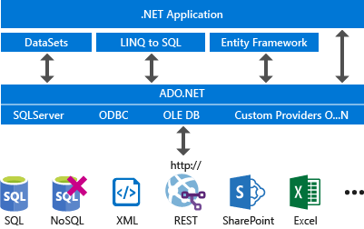
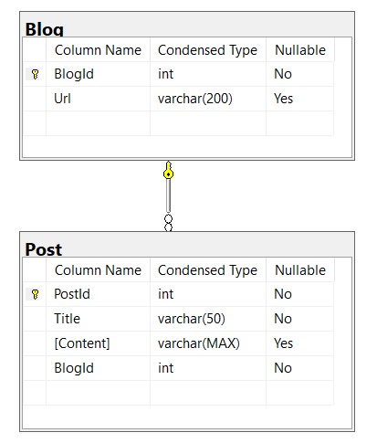

|               |                                           |                                        |
| ------------- | ----------------------------------------- | -------------------------------------- |
| **Modul 295** | **Backend für Applikationen realisieren** |  |

- [1. Datenbankschnittstelle ADO.NET](#1-datenbankschnittstelle-adonet)
  - [1.1. Was ist ADO.NET Core?](#11-was-ist-adonet-core)
  - [1.2. Grundlagen von ADO.NET Core](#12-grundlagen-von-adonet-core)
  - [1.3. Funktionen und Merkmale von ADO.NET Core](#13-funktionen-und-merkmale-von-adonet-core)
  - [1.4. Vorteile von ADO.NET Core](#14-vorteile-von-adonet-core)
  - [1.5. ADO.NET Core Klassen (unvollständig)](#15-adonet-core-klassen-unvollständig)
  - [1.6. Beispiel](#16-beispiel)
- [2. Aufgaben](#2-aufgaben)
  - [2.1. Blog Datenank erstellen](#21-blog-datenank-erstellen)
  - [2.2. ADO.NET Datenbankzugriff](#22-adonet-datenbankzugriff)

---

</br>

# 1. Datenbankschnittstelle ADO.NET

## 1.1. Was ist ADO.NET Core?

ADO.NET Core ist ein Teil des .NET Core-Frameworks und wurde entwickelt, um einen konsistenten Ansatz für den Zugriff auf Daten aus verschiedenen Datenquellen zu bieten.
ADO.NET steht für Active Data Objects .NET und dient als primäres Datenzugriffsmodell für .NET-Anwendungen, das die Kommunikation zwischen relationalen und nicht-relationalen Systemen ermöglicht.
Das Suffix "Core" weist auf die Integration mit .NET Core hin, einem plattformübergreifenden, leistungsstarken Open-Source-Framework für die Entwicklung moderner, Cloud-basierter, mit dem Internet verbundener Anwendungen.



## 1.2. Grundlagen von ADO.NET Core

ADO.NET (Active Data Objects .NET) ist eine Sammlung von .NET-Klassen, die zum Zugriff auf Datenbanken, zum Abfragen und Bearbeiten von Daten verwendet werden.
In ADO.NET Core, der plattformübergreifenden Version, geht es um dieselben Kernfunktionen, aber optimiert für .NET Core-Umgebungen, sodass es auf Windows, Linux und macOS funktioniert.

## 1.3. Funktionen und Merkmale von ADO.NET Core

- **Verbindung zu Datenbanken:** ADO.NET Core ermöglicht es Anwendungen, Verbindungen zu verschiedenen relationalen Datenbanken wie SQL Server, MySQL, PostgreSQL und SQLite herzustellen.
- **Datenabfrage und -manipulation:** Mit ADO.NET Core können Entwickler SQL-Abfragen ausführen, Daten abrufen, Einfüge-, Update- und Löschoperationen durchführen.
- **Verwendung von DataReader und DataSet:**
  - DataReader ermöglicht das schnelle Abrufen von Daten aus einer Datenbank, wobei die Daten in einem schreibgeschützten, sequentiellen Zugriff bereitgestellt werden.
  - DataSet stellt eine in-memory Repräsentation von Daten bereit und unterstützt das Arbeiten mit mehreren Tabellen und Beziehungen zwischen ihnen.
- **Asynchronität:** ADO.NET Core unterstützt asynchrone Datenbankoperationen, was die Leistung bei der Arbeit mit grossen Datenmengen oder langsamen Netzwerken verbessert.

## 1.4. Vorteile von ADO.NET Core

- **Leistung:** ADO.NET Core ist in der Regel schneller als höhere Abstraktionen wie Entity Framework, da es eine direktere Interaktion mit der Datenbank ermöglicht und keinen Overhead von ORM-Systemen wie EF hat.
- **Plattformunabhängigkeit:** Es ist ein Teil von .NET Core, sodass Anwendungen auf verschiedenen Betriebssystemen wie Windows, Linux und macOS laufen können.
- **Flexibilität:** ADO.NET Core bietet maximale Flexibilität und Kontrolle, da Entwickler direkt mit SQL und den zugrunde liegenden Datenbanken arbeiten können.

## 1.5. ADO.NET Core Klassen (unvollständig)

- **SqlConnection**
  - Stellt eine Verbindung zur Datenbank her und verwaltet diese. Mit dieser Klasse können Verbindungen geöffnet, geschlossen und Transaktionen gestartet werden.
- **SqlCommand**
  - Repräsentiert einen SQL-Befehl (Abfrage, Update, Insert) und wird verwendet, um SQL-Anweisungen oder gespeicherte Prozeduren auszuführen.
- **DbDataReader**
  - Liest Daten, die durch eine SQL-Abfrage zurückgegeben werden. Es handelt sich um ein „forward-only“ Leseobjekt, das die Daten in einem streamartigen, sequentiellen Format liest.
- **SqlDataAdapter**
  - Dient als Vermittler zwischen einer Datenbank und einem DataSet oder DataTable. Es ermöglicht das Abrufen und Aktualisieren von Daten aus der Datenbank in eine in-memory Datenstruktur.
- **DataSet**
  - Diese Klassen repräsentieren in-memory Datenstrukturen, die mehrere Tabellen (`DataTable`) oder ganze Datenbanken (DataSet) enthalten können. Sie sind nützlich für den disconnected Datenzugriff.

## 1.6. Beispiel

```c#
using System;
using System.Data.OleDb;
using System.Runtime.Versioning;

using System;
using System.Data.SqlClient;

static class Program
{
    static void Main()
    {
        const string connectionString =
            "Data Source=(local);Initial Catalog=Northwind;"
            + "Integrated Security=true";

        // Provide the query string with a parameter placeholder.
        const string queryString =
            "SELECT ProductID, UnitPrice, ProductName from dbo.products "
                + "WHERE UnitPrice > @pricePoint "
                + "ORDER BY UnitPrice DESC;";

        // Specify the parameter value.
        const int paramValue = 5;

        // Create and open the connection in a using block. This
        // ensures that all resources will be closed and disposed
        // when the code exits.
        using (SqlConnection connection =
            new(connectionString))
        {
            // Create the Command and Parameter objects.
            SqlCommand command = new(queryString, connection);
            command.Parameters.AddWithValue("@pricePoint", paramValue);

            // Open the connection in a try/catch block.
            // Create and execute the DataReader, writing the result
            // set to the console window.
            try
            {
                connection.Open();
                SqlDataReader reader = command.ExecuteReader();
                while (reader.Read())
                {
                    Console.WriteLine("\t{0}\t{1}\t{2}",
                        reader[0], reader[1], reader[2]);
                }
                reader.Close();
            }
            catch (Exception ex)
            {
                Console.WriteLine(ex.Message);
            }
            Console.ReadLine();
        }
    }
}
```

---

</br>

# 2. Aufgaben

## 2.1. Blog Datenank erstellen

|                     |                                                                                    |
| ------------------- | ---------------------------------------------------------------------------------- |
| **Lernziele**       | Sie können in Visual Studio oder Management Studio per Skript eine SQL             |
|                     | Datenbank mit mehreren Tabellen erstellen.                                         |
|                     | Sie können per SQL Skript Datensätze einfügen.                                     |
|                     | Sie können zu Testzwecken die Daten abfragen.                                      |
|                     |                                                                                    |
| **Sozialform**      | Einzelarbeit                                                                       |
| **Auftrag**         | siehe unten                                                                        |
| **Hilfsmittel**     | [Microsoft Learn](https://learn.microsoft.com/de-de/dotnet/framework/data/adonet/) |
| **Zeitbedarf**      | 50min                                                                              |
| **Lösungselemente** | SQL Skript Dateien                                                                 |

**Datenbank erstellen**
Erstelle in SQL-Server eine neue Datenbank mit den beiden nachfolgenden Tabellen.
Lege für diese Aufgabe in Visual Studio oder Management Studio ein Datenbankprojekt an.

Beachte, dass die beiden PK Attribute auf Identity gesetzt und die Lösch- und Aktualisierungsweitergabe beim Foreign Key BlogId aktiviert ist.




**Daten einfügen**
Erstelle eine SQL-Skript Datei, in welcher einige (min. 2 Blog) Einträge in die Datenbank eingefügt werden.

---

</br>

## 2.2. ADO.NET Datenbankzugriff

|                     |                                                                                                            |
| ------------------- | ---------------------------------------------------------------------------------------------------------- |
| **Lernziele**       | Sie können per ADO.NET Datenbankschnittstelle auf eine Datenbank zugreifen und Daten manipulieren.         |
|                     | Die können für Konfigurationsparameter eine appsettings.json Datei einer.NET Console Anwendung hinzufügen. |
|                     |                                                                                                            |
| **Sozialform**      | Einzelarbeit                                                                                               |
| **Auftrag**         | siehe unten                                                                                                |
| **Hilfsmittel**     | [Microsoft Learn](https://learn.microsoft.com/de-de/dotnet/framework/data/adonet/)                         |
| **Zeitbedarf**      | 90min                                                                                                      |
| **Lösungselemente** | Funktionierendes Visual Studio Projekt                                                                     |

**1. Console Anwendung**
Erstelle in Visual Studio eine Konsole Anwendung (Name=AdoNetDatabase) und programmiere mit ADO.NET nachfolgende Methoden.

- `Select()`: Diese Methode listet alle Blog Einträge auf der Konsole
- `Insert()`: Diese Methode fügt einen neuen Blog (Url) hinzu.

Verwende dabei folgende ADO.NET Klassen:

- `SqlConnection()`: Verbindung zur DB herstellen
- `SqlCommand()`: SQL-Kommandos festlegen (z.B. select … from .., insert into …)
- `SqlDataReader()` : Abfrageresultat Zeilenweise auslesen

Um den Datenbankzugriff herstellen wird ein Connection-String benötigt
(z.B. `"Data Source=.;Initial Catalog=EFCoreDbFirst;Integrated Security=True;"`)

**2. Konfigurationsdatei appsettings.json**
Die Verbindungszeichenfolge (Connection-String) sollte nicht im Programm hardcodiert sein.
Diese ist als Settings-String in der `appsettings.json` Datei einzutragen, sodass diese einfach konfiguriert werden kann.
Fügen Sie dem Projekt eine `appsettings.json` Datei hinzu und ändern Sie das Programm, sodass die Verbindungszeichenfolgen aus dieser Datei ausgelesen wird.

**3. Daten löschen (Optional)**
Erweitere die Anwendung, sodass auch Blog-Einträge gelöscht werden können
