|               |                                           |                                        |
| ------------- | ----------------------------------------- | -------------------------------------- |
| **Modul 295** | **Backend für Applikationen realisieren** |  |

- [1. Entity Framework Core (EF)](#1-entity-framework-core-ef)
  - [1.1. Was ist Entity Framework Core?](#11-was-ist-entity-framework-core)
  - [1.2. Was ist ein ORM?](#12-was-ist-ein-orm)
  - [1.3. Domain Klassen](#13-domain-klassen)
  - [1.4. Lösungsansatz Code-First](#14-lösungsansatz-code-first)
  - [1.5. Lösungsansatz DB-First](#15-lösungsansatz-db-first)
- [2. LINQ](#2-linq)
  - [2.1. Was ist LINQ?](#21-was-ist-linq)
  - [2.2. LINQ-Architektur](#22-linq-architektur)
  - [2.3. Beispiel LINQ-Abfrage](#23-beispiel-linq-abfrage)
  - [2.4. Beispiel Entity Framework mit LINQ](#24-beispiel-entity-framework-mit-linq)
- [3. Aufgaben](#3-aufgaben)
  - [3.1. Tutorial - Erste Schritte mit EF Core (SQLite)](#31-tutorial---erste-schritte-mit-ef-core-sqlite)
  - [3.2. EF Db-First Datenbankzugriff](#32-ef-db-first-datenbankzugriff)
  - [3.3. EF Code-First Datenbankzugriff](#33-ef-code-first-datenbankzugriff)

---

</br>

# 1. Entity Framework Core (EF)

## 1.1. Was ist Entity Framework Core?

Microsoft Entity Framework Core (EF Core) ist ein **Open-Source-Object-Relational Mapper (ORM)** für .NET-Anwendungen.
Es ermöglicht Entwicklern, mit relationalen Datenbanken in einer objektorientierten Weise zu arbeiten.
Anstatt direkt SQL-Abfragen zu schreiben, können Entwickler C#-Objekte verwenden und EF Core übernimmt die
Übersetzung in SQL-Statements, die an die Datenbank gesendet werden.
Entity Framework ist eine .Net Technologie, die den Datenzugriff für objektorientierten Programmcode abstrahiert.
Es überbrückt den Unterschied unser Datenbanken (zumeist Relationale Datenbanken oder SQL Datenbanken) zu objektorientiertem Code.

Zentrale Merkmale von EF Core sind:

- **Code-First**: Man kann zuerst die C#-Klassen definieren (die als Entitäten in der Datenbank repräsentiert werden) und EF Core erstellt basierend darauf die Datenbankstruktur.
- **Database-First**: Man kann auch eine bestehende Datenbank nutzen und EF Core generiert die entsprechenden C#-Klassen.
- **LINQ-Unterstützung**: EF Core unterstützt LINQ (Language Integrated Query), was die Abfrage von Daten aus der Datenbank in C# ermöglicht.
- **Cross-Platform**: EF Core läuft auf verschiedenen Plattformen (Windows, macOS, Linux).
- **Leistungsfähig und erweiterbar**: EF Core ist modular und ermöglicht benutzerdefinierte Erweiterungen für spezielle Anforderungen.

Im Wesentlichen vereinfacht EF Core den Umgang mit Datenbanken, indem es die Arbeit mit **Datenbankoperationen in einer objektorientierten Art** und Weise ermöglicht

## 1.2. Was ist ein ORM?

ORM steht für object-relational mapping
Im einfachsten Fall werden:

- Klassen auf Tabellen abgebildet
- Jedes Objekt entspricht einer Tabellenzeile
- Jedes Attribut hat eine Tabellenspalte
- Auch Vererbungshierarchien sind möglich

Objekt-relationale Mapper

- Entity Framework (.NET)
- Hibernate (Java)
- Doctrine (PHP)
- SQL Alchemy (Python)

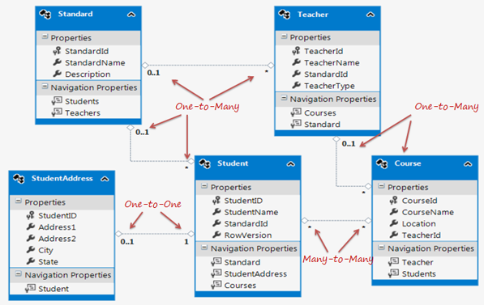

## 1.3. Domain Klassen

- In Anwendungen schreiben wir normalerweise Klassen wie Employee, Customer, Member und Courses für CRUD-Operationen.
- Diese Klassen werden Domänenklassen genannt.
- Ohne ORM müssen wir eine Menge Code schreiben, um die CRUD-Operationen zu implementieren oder die Daten nach dem Empfang aus der Datenbank zuzuordnen.
- Im EF Core können Domänenklassen im Code First Approach und DB First Approach verwendet werden.

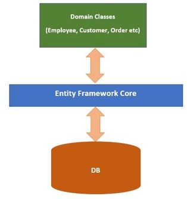

## 1.4. Lösungsansatz Code-First

Der Code-First-Ansatz basiert auf Domain Driven Design.

- Domain-Klassen erstellen.
- Erstellen einer DB-Kontextklasse, die von EF Core Db-Kontextklasse abgeleitet ist.
- EF Core erstellt Db und Tables mit einer Standardkonfiguration.

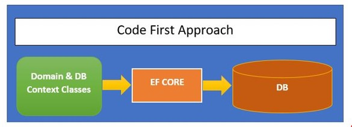

Datenbankmodell aus den C# Klassen erzeugen

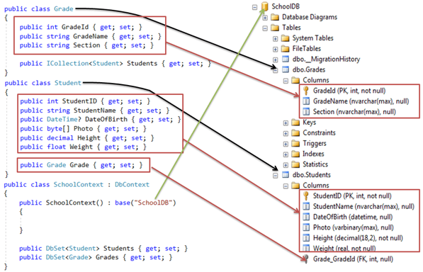

Aus C#-Klassen werden Datenbanktabellen

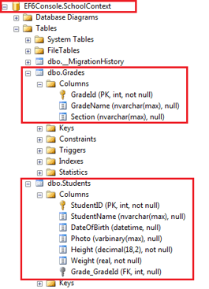

## 1.5. Lösungsansatz DB-First

Beim Datenbankansatz werden Domänenklassen und DB-Kontextklassen aus einer bestehenden Datenbank erstellt.
Bei bestehender Datenbank, sollte dieser Ansatz für die Arbeit mit ORM verwenden werden.

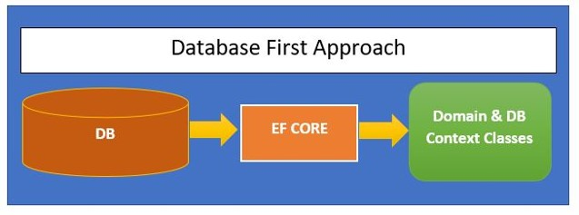

---

</br>

# 2. LINQ

## 2.1. Was ist LINQ?

- LINQ (Language Integrated Query) ist eine Technologie von Microsoft, die es ermöglicht, Abfragen direkt in .NET-Sprachen
wie C# oder VB.NET zu integrieren.
- Es ermöglicht Entwicklern, Daten auf deklarative Weise zu manipulieren und zu abzufragen, unabhängig davon, ob diese Daten aus einer Datenbank, einer XML-Datei, einer Collection oder einer anderen Datenquelle stammen.
- LINQ ermöglicht es, Abfragen direkt in der Programmiersprache (z. B. C#) zu schreiben, **anstatt SQL oder andere Abfragesprachen** verwenden zu müssen.
- LINQ kann für unterschiedliche Datenquellen wie Arrays, Listen, XML-Dokumente, SQL-Datenbanken, Entity Framework und mehr verwendet werden.
- LINQ verwendet eine spezielle, ausdrucksstarke Syntax, die an SQL erinnert, aber in C# integriert ist. Es gibt auch eine Vielzahl von Standard-Operatoren (z. B. `Where, Select, OrderBy, GroupBy`), um Daten zu filtern, zu sortieren, zu gruppieren oder zu aggregieren

## 2.2. LINQ-Architektur

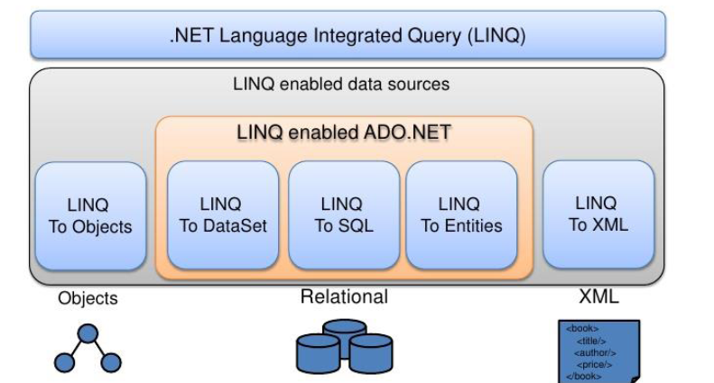  

## 2.3. Beispiel LINQ-Abfrage

```c#
var result = from person in people
        where person.Age > 18
        select person;
```

## 2.4. Beispiel Entity Framework mit LINQ

```c#
using System;
using System.Linq;
using System.Data.Objects;
using NorthwindModel;

class LinqSample
{
    public static void ExecuteQuery()
    {
        using (NorthwindEntities context = new NorthwindEntities())
        {
            try
            {
                var query = from category in context.Categories
                            select new
                            {
                                categoryID = category.CategoryID,
                                categoryName = category.CategoryName
                            };

                foreach (var categoryInfo in query)
                {
                    Console.WriteLine("\t{0}\t{1}",
                        categoryInfo.categoryID, categoryInfo.categoryName);
                }
            }
            catch (Exception ex)
            {
                Console.WriteLine(ex.Message);
            }
        }
    }
}
```

---

</br>

# 3. Aufgaben

## 3.1. Tutorial - Erste Schritte mit EF Core (SQLite)

|                     |                                                                                                              |
| ------------------- | ------------------------------------------------------------------------------------------------------------ |
| **Lernziele**       | Sie können per Entity-Framework auf eine Sqlite Datenbank zugreifen und Daten manipulieren.                  |
|                     | Sie können den Lösungsansatz "Code-First" umsetzen.                                                          |
|                     |                                                                                                              |
| **Sozialform**      | Einzelarbeit                                                                                                 |
| **Auftrag**         | siehe unten                                                                                                  |
| **Hilfsmittel**     | [Microsoft Learn](https://learn.microsoft.com/de-de/ef/core/get-started/overview/first-app?tabs=netcore-cli) |
| **Zeitbedarf**      | 90min                                                                                                        |
| **Lösungselemente** | Visual Studio Projekt                                                                                        |

Arbeite dieses [Tutorial](https://learn.microsoft.com/de-de/ef/core/get-started/overview/first-app?tabs=netcore-cli) komplett durch und prüfe die Funktionsweise des Programmcodes.
Beachte die erforderlichen Voraussetzungen (NuGet-Paket) und die Paket-Manager-Konsole (PMC) Befehle.

```console
Install-Package Microsoft.EntityFrameworkCore.Tools
Add-Migration InitialCreate
Update-Database
```

DB Browser for SQLite

Du kannst mit dem Datenbanktool "DB Browser for SQLite" den Inhalt der Datenbank `blogging.db` prüfen und bei Bedarf ändern.

[Download DB Browser for SQLite](https://sqlitebrowser.org/dl/)

---

</br>

[Tutorial](https://learn.microsoft.com/de-de/ef/core/get-started/overview/first-app?tabs=netcore-cli)

## 3.2. EF Db-First Datenbankzugriff

|                     |                                                                                          |
| ------------------- | ---------------------------------------------------------------------------------------- |
| **Lernziele**       | Sie können per Entity-Framework auf eine SQL Datenbank zugreifen und Daten manipulieren. |
|                     | Sie können den Lösungsansatz "Db-First" umsetzen.                                        |
|                     |                                                                                          |
| **Sozialform**      | Einzelarbeit                                                                             |
| **Auftrag**         | siehe unten                                                                              |
| **Hilfsmittel**     | [Microsoft Learn](https://learn.microsoft.com/de-de/ef/core/)                            |
| **Zeitbedarf**      | 90min                                                                                    |
| **Lösungselemente** | Visual Studio Projekt                                                                    |

**A1 - Console Anwendung:**

- Erstelle in Visual Studio eine Konsole Anwendung (Name=`EFCoreDbFirst`) und programmiere mit Entity-Framework (EF) eine Datenmutation in der EFCoreDbFirst Datenbank.
- Verwende dabei den Lösungsansatz von "**Db-First**"


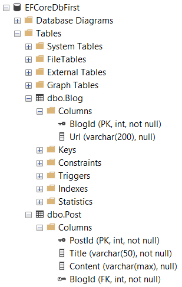

Folgende Datenmutation müssen programmiert werden:

- `Context.Blogs.Add()`
  - Diese Methode fügt einen neuen Blog (Url) hinzu.
- `Context.Blogs`
  - Diese Methode listet alle Blog Einträge, sortiert nach der BlogId auf der Konsole

Voraussetzungen:

- Die Datenbank EFCoreDbFirst muss bereits vorhanden sein.
- Dem Projekt müssen folgende Nuget Package-Manager hinzugefügt werden:
  - `PM> Install-Package Microsoft.EntityFrameworkCore.SqlServer`
  - `PM> Microsoft.EntityFrameworkCore.Tools`

Um die Model Klassen aus der Datenbanktabellen ins Projekt einzufügen muss im Package-Manager folgender Befehl verwendet werden:

- `PM>Scaffold-DbContext "Server=.\;Database=EFCoreDbFirst;Trusted_Connection=True;TrustServerCertificate=True;" Microsoft.EntityFrameworkCore.SqlServer -OutputDir Models -Context BlogContext`

**A2 - Post Einträge (Optional):**

- Erweitere die Anwendung, sodass auch Post-Einträge ausgelesen und eingefügt werden können.

---

</br>

## 3.3. EF Code-First Datenbankzugriff

|                     |                                                                                          |
| ------------------- | ---------------------------------------------------------------------------------------- |
| **Lernziele**       | Sie können per Entity-Framework auf eine SQL Datenbank zugreifen und Daten manipulieren. |
|                     | Sie können den Lösungsansatz "Code-First" umsetzen.                                      |
|                     |                                                                                          |
| **Sozialform**      | Einzelarbeit                                                                             |
| **Auftrag**         | siehe unten                                                                              |
| **Hilfsmittel**     | [Microsoft Learn](https://learn.microsoft.com/de-de/ef/core/)                            |
| **Zeitbedarf**      | 90min                                                                                    |
| **Lösungselemente** | Visual Studio Projekt                                                                    |

**A1 - Console Anwendung:**

- Erstelle in Visual Studio eine Konsole Anwendung (`EFCoreCodeFirst`) und generiere mit den Lösungsansatz "Code-First" aus den C#-Klassen eine neue Datenbank `EFCoreCodeFirst`.

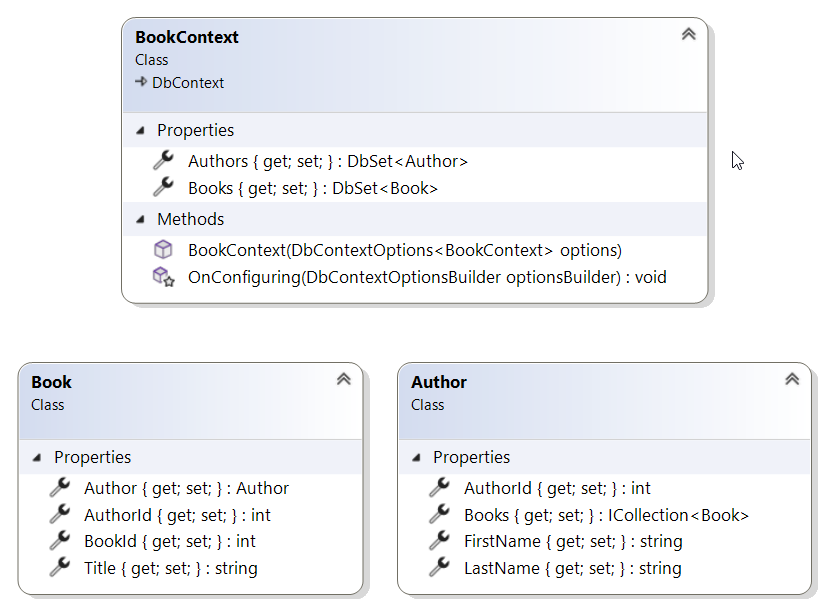
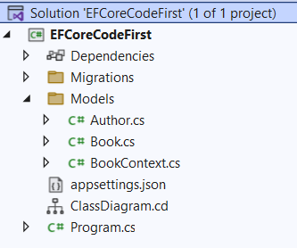
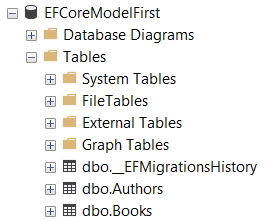

**Voraussetzungen:**

Dem Projekt müssen folgende Nuget Package-Manager hinzugefügt werden:

- `PM> Install-Package Microsoft.EntityFrameworkCore.SqlServer`
- `PM> Microsoft.EntityFrameworkCore.Tools`

Um aus den C#-Klassen die Datenbank mit den Tabellen zu generieren sind folgende Paket-Manager Befehle erforderlich:

- `PM>Add-Migration InitialCreate`
- `PM>Update-Database`

Um nachfolgende Änderungen an den C# Klassen in die Datenbank zu synchronisieren sind folgende Package-Manager Befehle nötig:

- `PM> Add-Migration <KURZBEZEICHNUNG DER ÄNDERUNG>`
- `PM> Update-Database`

Folgende Datenmutation müssen programmiert werden:

- `Context.Books.Add()`: Diese Methode fügt einen neuen Autor mit min. drei Büchern hinzu.
- `Context.Books`: Diese Methode listet alle Buchtitel auf der Konsole.

**A2 - Books Einträge anzeigen:**

- Erweitere die Anwendung, sodass die Autoren mit den Büchern gelistet werden.

**A3 - Books Einträge erfassen:**

- Erweitere die Anwendung, sodass die Autoren mit den Büchern eingefügt werden.
