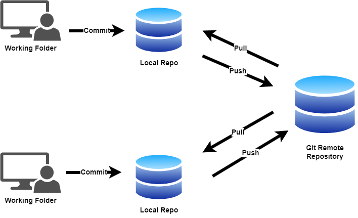
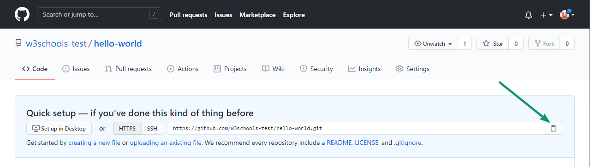

|               |                                           |                                        |
| ------------- | ----------------------------------------- | -------------------------------------- |
| **Modul 295** | **Backend für Applikationen realisieren** |  |

- [1. GIT](#1-git)
  - [1.1. Was ist GIT](#11-was-ist-git)
  - [1.2. Warum sollten Sie Git verwenden?](#12-warum-sollten-sie-git-verwenden)
- [2. GIT-Befehle für den Alltag](#2-git-befehle-für-den-alltag)
  - [2.1. `git init`](#21-git-init)
  - [2.2. `git clone`](#22-git-clone)
  - [2.3. `git status`](#23-git-status)
  - [2.4. `git add`](#24-git-add)
  - [2.5. `git commit`](#25-git-commit)
  - [2.6. `git log`](#26-git-log)
  - [2.7. `git branch`](#27-git-branch)
  - [2.8. `git checkout`](#28-git-checkout)
  - [2.9. `git merge`](#29-git-merge)
  - [2.10. `git pull`](#210-git-pull)
  - [2.11. `git push`](#211-git-push)
  - [2.12. `git remote`](#212-git-remote)
  - [2.13. `git fetch`](#213-git-fetch)
- [3. Weitere Informationen zu GIT](#3-weitere-informationen-zu-git)
- [4. Aufgaben](#4-aufgaben)
  - [4.1. GitHub-Repository einrichten](#41-github-repository-einrichten)
  - [4.2. Git Repository lokal erstellen und auf GitHub hochladen](#42-git-repository-lokal-erstellen-und-auf-github-hochladen)
  - [4.3. Tutorial zu Visual Studio Code und GIT](#43-tutorial-zu-visual-studio-code-und-git)

# 1. GIT

## 1.1. Was ist GIT

Git ist ein unverzichtbares Werkzeug für Entwickler, das Versionskontrolle und Zusammenarbeit ermöglicht.
GIT ist ein sogenanntes **Versionskontrollsystem (VCS)** und wurde Anfang 2005 von Linus Torvalds, dem Initiator des Linux-Kernels, entwickelt.
Ganz gleich, ob Sie an einem Einzelprojekt arbeiten oder mit einem Team zusammenarbeiten, die Beherrschung der Git-Befehle kann Ihren Arbeitsablauf und Ihre Produktivität erheblich verbessern.
In diesem Artikel stellen wir Ihnen 20 nützliche Git-Befehle vor, die jeder Entwickler kennen sollte.

---

## 1.2. Warum sollten Sie Git verwenden?

- Sie haben Ihr Programm zum Laufen gebracht und versuchen, etwas Neues zu implementieren, aber es will nicht funktionieren, und Sie wissen nicht, was Sie falsch gemacht haben, und Sie wollen einfach wieder von vorne anfangen und es erneut versuchen.
- Leider haben Sie kein Versionskontrollsystem verwendet, so dass Sie jetzt jede Änderung, die Sie vorgenommen haben, manuell löschen müssen. Das bedeutet nicht nur eine Menge Arbeit, sondern Sie verlieren auch den gesamten Code, den Sie gerade geschrieben haben.
- Dies lässt sich durch die Verwendung von Git vermeiden. Ein weiterer Grund ist, dass Git so weit verbreitet ist, dass Sie es eher früher als später ohnehin verwenden müssen.

---

# 2. GIT-Befehle für den Alltag

Die wichtigsten und am häufigsten verwendeten GIT-Befehle:

```console
git clone <url> <folder> # clone remote repository in folder (omit folder name will use repository name as foldername)
git add <file> # stage one or multiple files
git commit # commit all staged files
git push # push all new commits to remote repository
git pull # pull all new commits from remote repository
git checkout <branch> # change branch
```

</br>



---

## 2.1. `git init`

Der Befehl `git init` initialisiert ein neues Git-Repository.
Dieser Befehl erstellt ein `.git`-Verzeichnis in Ihrem Projektordner und richtet die erforderlichen Dateien und Verzeichnisse für die Versionskontrolle ein.

```console
git init
```

---

## 2.2. `git clone`

Der Befehl `git clone` erstellt eine Kopie eines bestehenden Repositorys.
Dies ist nützlich, wenn Sie zu einem Projekt beitragen oder einfach dessen Codebasis erkunden möchten.

```console
git clone <https://github.com/user/repo.git>
```

---

## 2.3. `git status`

Der Befehl git status zeigt den Zustand des Arbeitsverzeichnisses und des Bereitstellungsbereichs an. Er zeigt an, welche Änderungen bereitgestellt wurden, welche nicht, und welche Dateien nicht von Git verfolgt werden.

```console
git status
```

---

## 2.4. `git add`

Mit dem Befehl `git add` werden Änderungen für die nächste Übertragung bereitgestellt.
Sie können einzelne Dateien oder alle Änderungen in einem Verzeichnis bereitstellen.

```console
git add file.txt      # Add a specific file
git add .             # Add all changes
```

---

## 2.5. `git commit`

Mit dem Befehl `git commit` wird ein Schnappschuss der aktuellen Änderungen des Projekts erstellt.
Es ist wichtig, aussagekräftige Commit-Nachrichten zu schreiben, die die Änderungen beschreiben.

```console
git commit -m "Add initial project files"
```

---

## 2.6. `git log`

Der Befehl `git log` zeigt den Commit-Verlauf für den aktuellen Zweig an.
Sie können verschiedene Optionen verwenden, um die Ausgabe zu filtern und zu formatieren.

```console
git log              # Show commit history
git log --oneline    # Show commit history in one line per commit
```

---

## 2.7. `git branch`

Der Befehl `git branch` listet Zweige auf, erstellt oder löscht sie.
Zweige ermöglichen es Ihnen, gleichzeitig an verschiedenen Teilen eines Projekts zu arbeiten.

```console
git branch                   # List all branches
git branch new-feature       # Create a new branch
git branch -d old-branch     # Delete a branch
```

--

## 2.8. `git checkout`

Mit dem Befehl `git checkout` werden Zweige gewechselt oder Arbeitsbaumdateien wiederhergestellt.
Dies ist nützlich, um zwischen verschiedenen Entwicklungslinien zu wechseln.

```console
git checkout main            # Switch to the main branch
git checkout new-feature     # Switch to a different branch
git checkout -- file.txt     # Discard changes in a file
```

---

## 2.9. `git merge`

Mit dem Befehl `git merge` werden Änderungen aus einem Zweig in einem anderen zusammengefasst.
Dies wird üblicherweise verwendet, um Funktionszweige in den Hauptzweig zu integrieren.

```console
git checkout main
git merge new-feature        # Merge new-feature branch into main
```

---

## 2.10. `git pull`

Der Befehl `git pull` holt sich Änderungen aus einem entfernten Repository und fügt sie in den aktuellen Zweig ein.
Dies ist nützlich, um Ihr lokales Repository auf dem neuesten Stand zu halten.

```console
git pull origin main         # Fetch and merge changes from the main branch
```

---

## 2.11. `git push`

Mit dem Befehl `git push` werden lokale Änderungen in ein entferntes Repository hochgeladen. Dies ist nützlich, um Ihre Arbeit mit anderen zu teilen.

```console
git push origin main         # Push changes to the main branch
```

---

## 2.12. `git remote`

Der Befehl `git remote` verwaltet Verbindungen zu entfernten Repositorys.
Sie können ihn verwenden, um entfernte Repositorys hinzuzufügen, zu entfernen oder aufzulisten.

```console
git remote add origin https://github.com/user/repo.git  # Add a remote repository
git remote -v                                          # List remote repositories
git remote remove origin                               # Remove a remote repository
```

---

## 2.13. `git fetch`

Der Befehl `git fetch` lädt Objekte und Referenzen aus einem entfernten Repository herunter.
Im Gegensatz zu git pull führt er die Änderungen nicht in den aktuellen Zweig ein.

```console
git fetch origin main  # Fetch changes from the main branch

```

---

</br>

# 3. Weitere Informationen zu GIT

- <https://rogerdudler.github.io/git-guide/index.de.html>
- <https://dev.to/milu_franz/git-explained-the-basics-igc>
- <https://michster.de/was-ist-git/>
- <https://girliemac.com/blog/2017/12/26/git-purr/>
- <https://learngitbranching.js.org/?locale=de_DE>

---

</br>

# 4. Aufgaben

## 4.1. GitHub-Repository einrichten

|                     |                                                                                   |
| ------------------- | --------------------------------------------------------------------------------- |
| **Lernziele**       | Sie kennen GIT als Versionsverwaltungssystem                                      |
|                     | Sie haben einen GitHub Zugang                                                     |
|                     | Sie können ein Repository anlegen und klonen                                      |
|                     | Sie können Änderungen durchführen und ins Repository überführen                   |
| **Sozialform**      | Einzelarbeit                                                                      |
| **Auftrag**         | siehe unten                                                                       |
| **Hilfsmittel**     | [Tutorial](https://www.w3schools.com/git/git_remote_getstarted.asp?remote=github) |
| **Zeitbedarf**      | 40 min                                                                            |
| **Lösungselemente** | GitHub Repository                                                                 |

Prüfen Sie, ob GIT auf Ihrem Rechner installiert ist.
Wenn nicht, dann installieren Sie GIT von <https://git-scm.com/downloads/win>

```console
git --version
```

Machen Sie den Laptop mit Ihrem GitHub-Account bekannt.
</br>
**Wichtig**: Die E-Mailadresse muss mit der GitHub Registrierung identisch sein.

Teilen Sie GIT Ihren Namen und E-Mail mit:

```console
git config --global user.name "Max"
git config --global user.email max@muster.ch

# list config
git config --list
```

**Registrieren Sie sich mit Ihrer E-Mail auf [GitHub](https://github.com/)**


---

**Erstellen Sie ein neues Repository z.B hello-world.**


---

**Kopieren Sie den URL zum angelegten Repository.**



---

**Klonen Sie nun das Repository auf Ihrem Rechner.**

```console
git clone https://github.com/user/repo.git
git status

# Erstelle mit dem Editor eine neue Datei z.B. Test.txt
git add Test.txt

git commit -m "Add new text file to project files"
git push origin main
```

---

</br>

## 4.2. Git Repository lokal erstellen und auf GitHub hochladen

|                     |                                                                                   |
| ------------------- | --------------------------------------------------------------------------------- |
| **Lernziele**       | Sie kennen GIT als Versionsverwaltungssystem                                      |
|                     | Sie haben einen GitHub Zugang                                                     |
|                     | Sie können ein Repository anlegen und klonen                                      |
|                     | Sie können Änderungen durchführen und ins Repository überführen                   |
| **Sozialform**      | Einzelarbeit                                                                      |
| **Auftrag**         | siehe unten                                                                       |
| **Hilfsmittel**     | [Tutorial](https://www.w3schools.com/git/git_remote_getstarted.asp?remote=github) |
| **Zeitbedarf**      | 40 min                                                                            |
| **Lösungselemente** | GitHub Repository                                                                 |

Erstelle ein neues lokales Git-Repository und gehe dabei wie folgt vor:

[Adding a local repository to GitHub using Git](https://docs.github.com/en/migrations/importing-source-code/using-the-command-line-to-import-source-code/adding-locally-hosted-code-to-github#adding-a-local-repository-to-github-using-git)

```console
# Erstelle ein neues Verzeichnis mit dem Projektnamen (z.B. hello-git)
C:\projekte\>mkdir hello-git

# Öffne die Eingabeaufforderung (CMD) und setzte dich mit cd in das Projektverzeichnis (WICHTIG!!!)
C:\>cd C:\projekte\>mkdir hello-git

# Nun erstelle ein lokales GIT-Repository
C:\projekte\hello-git>git init -b main`

# Registriere dein Rechnername in GIT falls dies noch nicht gemacht wurde (EMail-Adresse muss mit der GitHub-Registrierung übereinstimmen)
git config --global user.name "Max"
git config --global user.email max@muster.ch

# Prüfen den Status deines lokalen Repository
C:\projekte\hello-git>git status

# Erstelle mit dem Editor eine neue Datei z.B. index.html

#Füge diese Datei (index.html) mit git add dem lokalen Repository hinzu
C:\projekte\hello-git>git add Test.txt

# Prüfen den Status deines lokalen Repository, nachdem die Datei hinzugefügt wurde
C:\projekte\hello-git>git status

# Bestätige nun die Veränderungen
C:\projekte\hello-git>git commit -m "Add new html file to project files"

# Melde dich nun in GitHub an und erstelle neues GitHub Repository (Browser)
# Kopiere den REMOTE-URL deines Repository (z.B. https:/github.com/DEINNAME/hello-git.git)

# [Adding a local repository to GitHub using Git](https://docs.github.com/en/migrations/importing-source-code/using-the-command-line-to-import-source-code/adding-locally-hosted-code-to-github#adding-a-local-repository-to-github-using-git)

# Teile den REMOTE-URL (https:/github.com/DEINNAME/hello-git.git) deinem lokalen Repository mit:
C:\projekte\hello-git>git remote add origin REMOTE-URL

# Prüfe ob dein REMOTE Repository korrekt eingetragen ist.
C:\projekte\hello-git>git remote -v

# Übertrage die Änderungen nun in das Remote Repository
C:\projekte\hello-git>git push origin main

# Prüfe mit Browser auf GitHub ob die durchgeführten Änderungen hochgeladen wurden.
```

</br>

---

## 4.3. Tutorial zu Visual Studio Code und GIT

|                     |                                                                                                           |
| ------------------- | --------------------------------------------------------------------------------------------------------- |
| **Lernziele**       | Sie kennen GIT als Versionsverwaltungssystem                                                              |
|                     | Sie haben einen GitHub Zugang                                                                             |
|                     | Sie können mit Visual Studio Code GIT Befehle ausführen                                                   |
|                     | Sie können ein Repository anlegen und klonen                                                              |
|                     | Sie können Änderungen durchführen und ins Repository überführen                                           |
| **Sozialform**      | Einzelarbeit                                                                                              |
| **Auftrag**         | siehe unten                                                                                               |
| **Hilfsmittel**     | [Tutorial](https://learn.microsoft.com/de-de/training/modules/introduction-to-github-visual-studio-code/) |
| **Zeitbedarf**      | 50 min                                                                                                    |
| **Lösungselemente** | GitHub Repository                                                                                         |

Verfolge die Ausführungen im Tutorial und versuche die Aufgaben mit Deinem GitHub nachzuvollziehen.
[Using Git source control in VS Code](https://code.visualstudio.com/docs/introvideos/versioncontrol)

Verfolge die Ausführungen der weiteren Tutorials (alle Vidoes) und versuche die Aufgaben mit Deinem GitHub nachzuvollziehen.
[Tutorial](https://learn.microsoft.com/de-de/training/modules/introduction-to-github-visual-studio-code/)

**Optional:**
Hier steht eine Anleitung zur Benutzung von GIT in Visual Studio zur Verfügung.
[Informationen zu Git in Visual Studio](https://learn.microsoft.com/de-ch/visualstudio/version-control/git-with-visual-studio?view=vs-2022)
