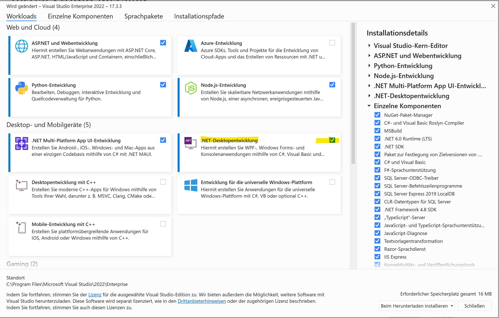
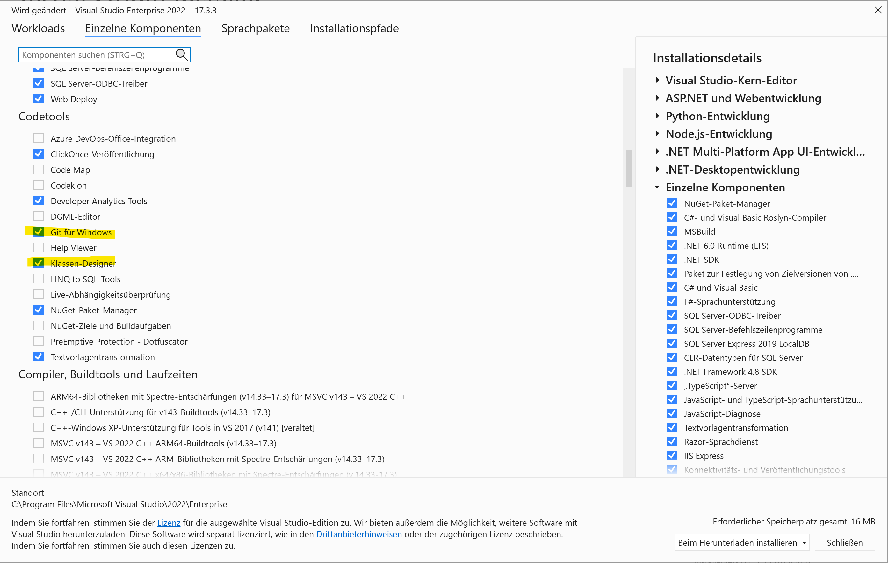
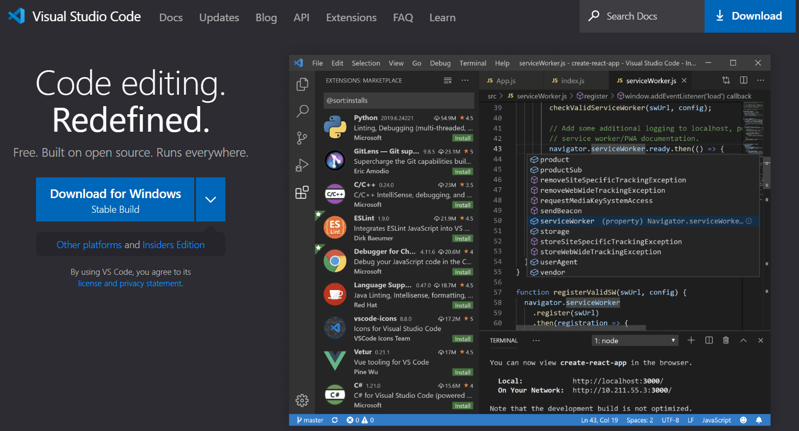
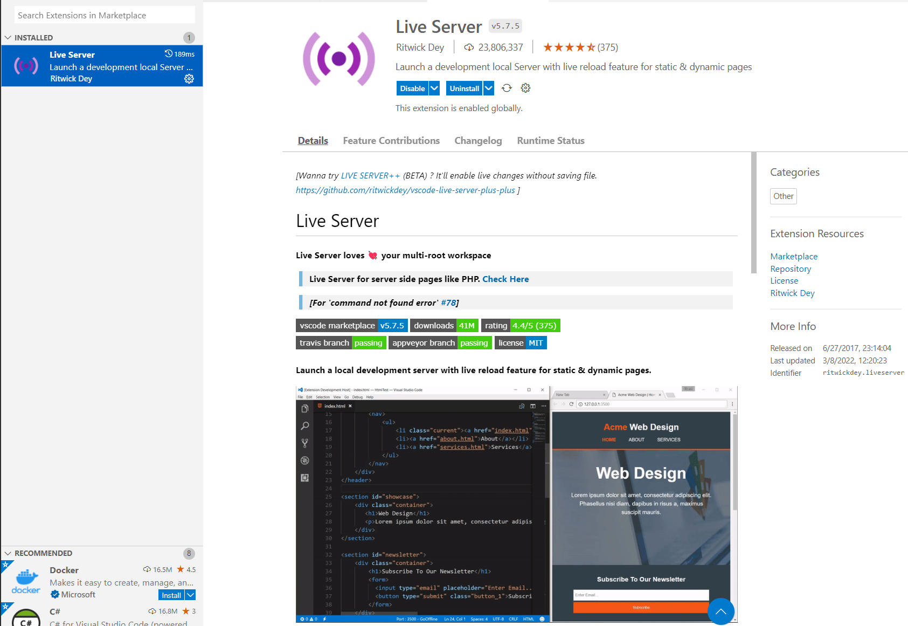
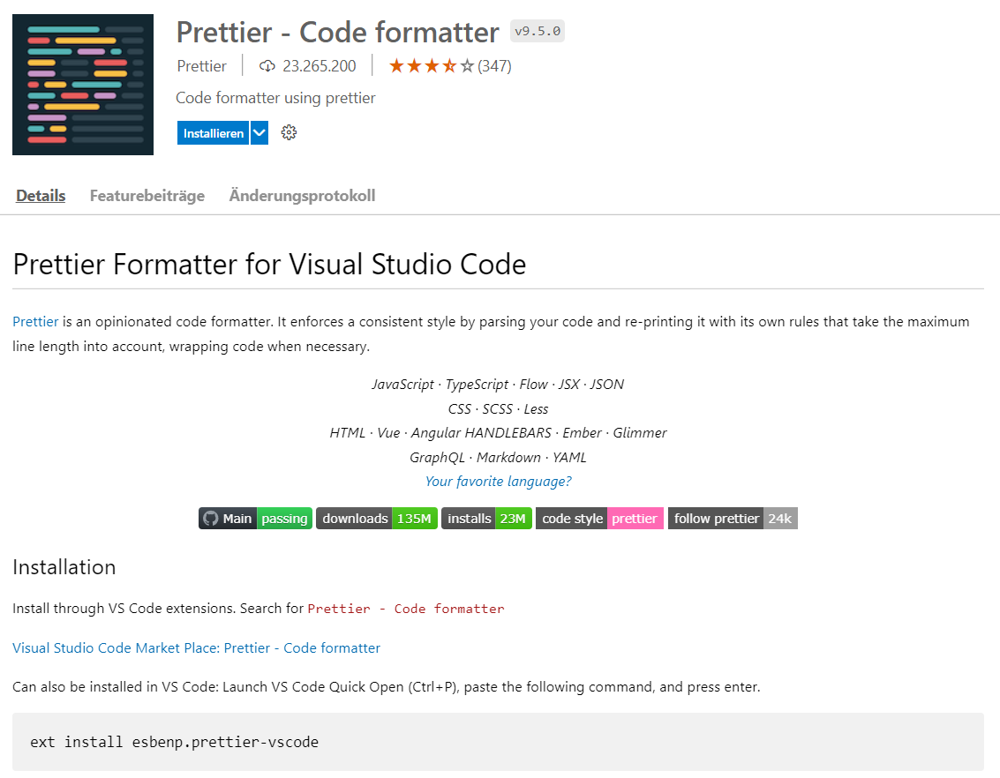
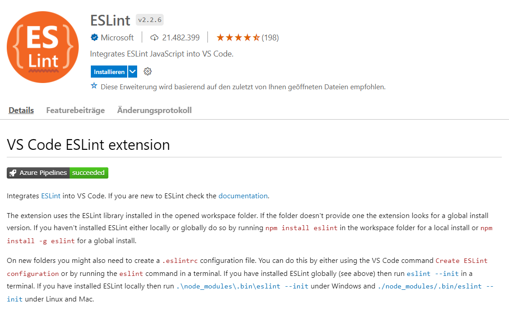
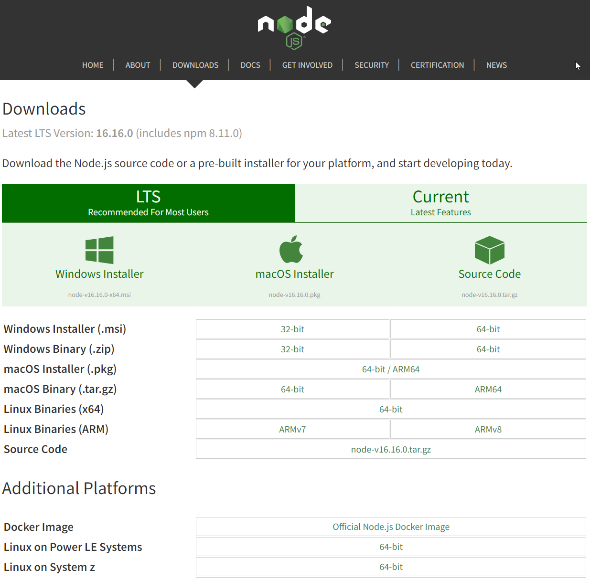
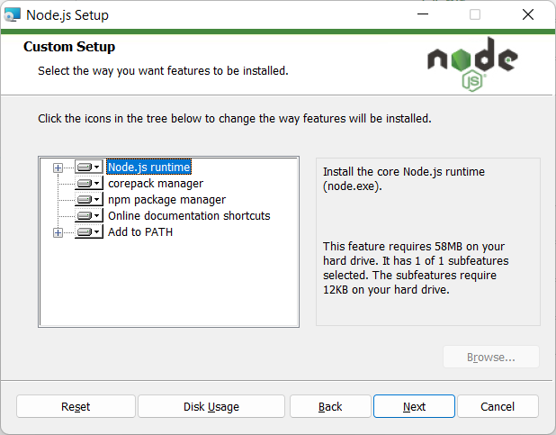
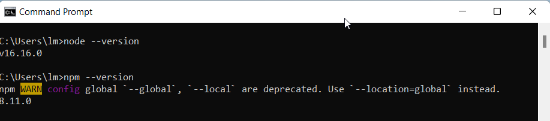
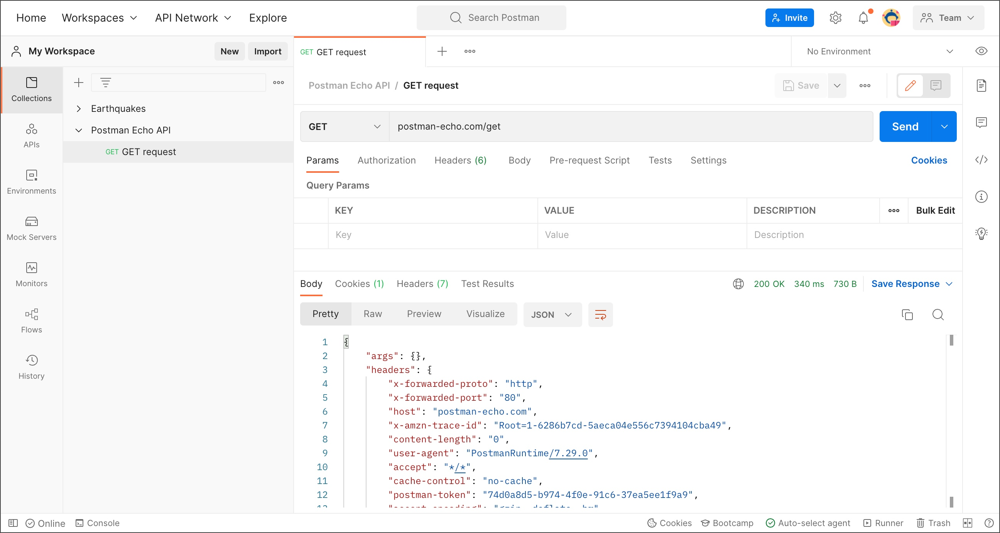

|               |                                           |                                        |
| ------------- | ----------------------------------------- | -------------------------------------- |
| **Modul 295** | **Backend für Applikationen realisieren** |  |

- [1. Voraussetzungen / Softwareinstallationen](#1-voraussetzungen--softwareinstallationen)
  - [1.1. Visual Studio](#11-visual-studio)
  - [1.2. Visual Studio Code](#12-visual-studio-code)
  - [1.3. Extension - MS-SQL](#13-extension---ms-sql)
  - [1.4. Extension - Live Server](#14-extension---live-server)
  - [1.5. Extension - REST-Client](#15-extension---rest-client)
  - [1.6. Extension - Prettier - Code formatter](#16-extension---prettier---code-formatter)
  - [1.7. Extension - ESLint](#17-extension---eslint)
  - [1.8. SQL-Datenbanken](#18-sql-datenbanken)
  - [1.9. Node JS](#19-node-js)
    - [1.9.1. Installation und Version prüfen](#191-installation-und-version-prüfen)
  - [1.10. Postman](#110-postman)
- [2. Aufgabe - Installation u. Softwarevoraussetzungen / Tools](#2-aufgabe---installation-u-softwarevoraussetzungen--tools)

 

# 1. Voraussetzungen / Softwareinstallationen

## 1.1. Visual Studio

[Download Visual Studio](https://visualstudio.microsoft.com/de/vs/community/)

## 1.2. Visual Studio Code

[Download Visual Studio Code](https://code.visualstudio.com/)

## 1.3. Extension - MS-SQL

## 1.4. Extension - Live Server

## 1.5. Extension - REST-Client

## 1.6. Extension - Prettier - Code formatter

## 1.7. Extension - ESLint

---

## 1.8. SQL-Datenbanken

Es muss nur eine Datenbanksoftware installiert werden.
Es wird empfohlen SQL-Server zu verwenden.

Alternativ kann auch MySQL verwendet werden.

---

## 1.9. Node JS

[Node js](https://nodejs.org/en)

 

> Installationspfad: C:\Program Files\nodejs
> In der PATH Variable muss Installationspfad von Nodejs enthalten sein.

### 1.9.1. Installation und Version prüfen

- `C:\>node --version`
- `C:\>npm --version`

---

 

## 1.10. Postman

[Postman](https://www.postman.com/downloads/) ist eines der beliebtesten Werkzeuge zum Testen von APIs (Application Programming Interfaces). APIs sind Schnittstellen zwischen Programmen, über die die Anwendungen miteinander kommunizieren.

Haupteinsatzgebiet ist das Testen von REST APIs auf HTTP-Basis. Der grundlegende Aufbau fokussiert sich dabei auf das Verarbeiten und Validieren von Requests und deren Responses. HTTP-Requests lassen sich in Postman mit zugehörigen Parametern über den visuellen Request-Builder spezifizieren und absenden. Die Responses können direkt angesehen und ausgewertet werden, sei es grafisch oder über die interne Programmierschnittstelle von Postman mittels JavaScript.

[Download Postman](https://www.postman.com/downloads/)

---

 

# 2. Aufgabe - Installation u. Softwarevoraussetzungen / Tools

| Vorgabe             | Beschreibung                         |
| ------------------- | ------------------------------------ |
| Lernziele           | Softwarevoraussetzungen sind erfüllt |
| Sozialform          | Einzelarbeit                         |
| Auftrag             | Softwareinstallationen auf Laptop    |
| Hilfsmittel         | siehe Download links                 |
| Erwartete Resultate |                                      |
| Zeitbedarf          | 40 min                               |
| Lösungselmente      | Ausführbare SW Anwendungen           |

Installiere alle erforderlichen Softwarekomponenten auf Deinem Rechner.
Teste soweit möglich, dass alle Komponenten ohne Fehler ausgeführt werden und funktionstauglich sind.
